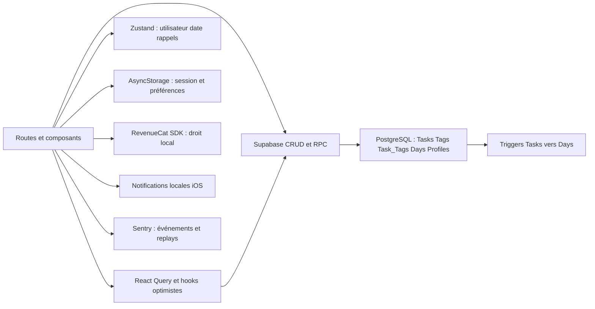
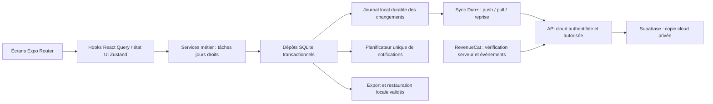

# Dun — audit et roadmap de publication iPhone

Date de l’audit : **30 septembre 2026**. Révision examinée : **`ed6cba1`**. État Git initial : propre. Livrable de la session d’audit : ce document uniquement ; aucune correction, installation, migration, modification de configuration ou publication réalisée pendant cet audit. La reprise approuvée est distinguée ci-dessous.

## Suivi de reprise — 1–2 octobre 2026

Le propriétaire a approuvé les seuls lots PROD-001/006/007. Hiérarchie de reprise : décisions explicites → ce document → document commercial → conventions compatibles de `AGENTS.md` et ancienne roadmap. `docs/product-v1.md` et `docs/data-contract-v1.md` détaillent les contrats. Les sections d’audit ci-dessous restent des preuves datées ; leurs constats ne valent pas validation du code actuel. Aucune opération distante, build, publication, suppression ou push dans cette reprise.

| Lot | État au 02/10 | Preuve / reste à faire |
|---|---|---|
| PROD-001 | Terminé pour le périmètre documentaire | `docs/product-v1.md` : matrice, décisions Q/L, exemples P01–P10, échéances UTC ; hiérarchie/minuit/Xcode corrigés dans les documents de travail, identifiants DUN conservés. Aucun changement du comportement métier |
| PROD-006 | Partiel : socle local vérifié, CI distante à démontrer | `docs/quality.md` : installation propre, types mobile/Node/tests/Deno, lint 0 erreur / 215 avertissements, 74 tests dont 3 échecs attendus identifiés ; mode strict échoue sur ces 3 défauts. Workflow préparé ; exécution GitHub et protection de branche non réalisées |
| PROD-007 | Terminé pour le contrat préparatoire | `docs/data-contract-v1.md`, types et validateur isolés, exemples de snapshots vérifiés et scénarios de reprise/sync spécifiés. Aucun SQLite, adaptateur d'écran ou migration ; vraies transactions à tester dans leurs lots |

État Git préservé : aucun fichier suivi modifié au départ ; cette roadmap était non suivie et le reste. Sa copie initiale exacte a été conservée hors dépôt. La prochaine tâche locale prête est **PROD-008**, avec PROD-009 possible indépendamment sur les interfaces : le socle local de 006 est disponible, sa preuve CI distante reste explicitement ouverte. Ces lots ne sont pas commencés par cette reprise. Les contrôles natifs, achats, RLS et accès déjà refusés restent hors périmètre.

## 1. Résumé exécutif

**L’application ne constitue pas encore une V1 publiable conforme au nouveau plan commercial.** Le principal travail est de rendre les données réellement locales et le compte facultatif, puis de construire une synchronisation Dun+ autorisée côté serveur. Cela dépasse une simple modification du paywall. La stack actuelle convient : conserver Expo, React Native, Expo Router, React Query, Zustand, Supabase et RevenueCat. L’ajout de SQLite est justifié par la promesse explicite de fonctionnement hors ligne et par les opérations atomiques nécessaires ; une réécriture générale de l’interface ne l’est pas.

Les urgences identifiées dans le dépôt sont l’import qui efface avant de restaurer, les effacements de compte fractionnés et plusieurs autorisations SQL trop larges. Le complément d’audit distant du 30/09/2026 confirme plusieurs de ces configurations dans **Dun et Dun Prod**, désormais accessibles. Les structures métier sont identiques sur le périmètre comparé, mais des grants bêta diffèrent et la configuration locale de l’app ne vise pas le même projet que la CLI. Voir E20. Aucune exploitation, écriture distante ni correction n’a été tentée.

Le nouveau document commercial prévaut, notamment sur **la clôture à minuit**, contre 4 h dans `AGENTS.md`, l’ancienne roadmap et une partie du code. L’objectif choisi n’est actuellement pas persisté ; le Repos n’a pas d’historique daté ; les statistiques et le Daily n’utilisent pas une règle commune complète. Les limites actuelles de six tâches et deux tags, la Box payante et les remises à zéro à l’expiration contredisent la nouvelle offre.

L’ordre recommandé est : **réduire les risques actuels → établir les contrats et les premiers tests → livrer le cœur local → fiabiliser identité et cloud → aligner les parcours commerciaux → valider un véritable binaire Release → TestFlight et App Review**. Les contrôles et tests commencent dès les fondations, pas après leur développement.

Résultats des vérifications : lint Expo réussi avec 90 avertissements ; lint de tout le dépôt échoué avec 5 erreurs et 92 avertissements ; TypeScript global échoué sur 7 diagnostics Deno ; contrôle isolé du code mobile sans émission réussi ; traduction générée cohérente avec les YAML. Aucun build, test automatisé métier, achat sandbox, test RLS ou parcours sur appareil n’a été validé.

Le propriétaire a confirmé pendant l’audit : **uniquement des comptes de test**, espaces de données séparés avec transfert explicite possible, **compte Dun obligatoire avant achat**, et conflit résolu par **dernière modification reçue avec version précédente récupérable**. Aucune migration de clientèle réelle n’est à financer pour cette V1 ; le lot historique devient conditionnel hors chemin critique. L’obligation de compte avant achat est une exception explicite au document joint. En cas de panne RevenueCat, les fonctions Dun+ locales restent autorisées jusqu’à la dernière échéance connue, puis les nouvelles actions premium sont verrouillées sans effacement. Une édition passée recalcule la série courante tout en conservant la première réussite historique. Il n’y a ni calendrier promis, ni garantie d’acceptation Apple.

**Livraison et lancement confirmés :** builds locaux et distribution via Xcode vers TestFlight/App Store Connect ; EAS facultatif. Première publication en France, application et présentation en français et en anglais ; Europe puis monde ultérieurement. Un seul appareil physique disponible : iPhone 15 Pro Max. Ces informations décrivent le parcours du propriétaire, pas des validations exécutées par cet audit.

## 2. Périmètre examiné, accès disponibles et limites de l’audit

### Sources et hiérarchie

Cette sous-section restitue les sources de l’audit du 30/09 ; pour les travaux actuels, appliquer la hiérarchie du suivi de reprise ci-dessus. Les formulations « non modifié » et les contrôles initiaux qui suivent décrivent cet audit, pas le résultat des lots du 01–02/10.

1. Demande utilisateur : audit et planification uniquement.
2. [Nouveau plan commercial](/Users/yanis/Desktop/offre-commerciale-v1-pour-agents.md), lu intégralement, et précisions explicites du propriétaire consignées en section 12. Son contenu produit est repris ici pour que la roadmap reste autonome ; ses formulations destinées aux agents ne constituent pas une autorisation d’implémenter.
3. [Instructions du dépôt](/Users/yanis/Code/Dun/Dun/AGENTS.md:1) et [ancienne roadmap](/Users/yanis/Code/Dun/Dun/ROADMAP.md:144), examinées comme contexte. Leurs prescriptions commerciales incompatibles, surtout 4 h, sont remplacées par le document joint. Elles n’ont pas été modifiées.
4. Code, migrations et fichiers générés locaux : preuves d’implémentation, pas référence métier.

Les identifiants **PROD-001 à PROD-034** sont propres à ce plan et doivent rester stables. Les correspondances DUN indiquées dans les lots évitent de mener deux chantiers concurrents. Les cases étaient toutes ouvertes à la fin de l’audit ; seuls les lots démontrés lors de la reprise sont cochés avec leurs preuves.

### Inventaire examiné

377 fichiers suivis. Lecture ciblée des routes de démarrage/authentification/onboarding, accueil, Box, Daily, Repos, statistiques, réglages, import/export et abonnement ; des services `lib/`, du store, des trois migrations SQL, de l’Edge Function, des scripts, des plugins natifs et des configurations. Recherches transversales des accès Supabase, contrôles premium, appels de restauration, gestion des erreurs et références aux fonctionnalités. Les médias n’ont pas fait l’objet d’une revue graphique exhaustive et chaque ligne de chaque composant n’a pas été auditée.

`ios/` et `android/` ne contiennent **aucun fichier suivi** ; `ios/` existe localement et est ignoré. Son contenu a été inspecté comme indice, jamais comme preuve d’une archive Release Xcode reproductible. `plugins/`, `package-lock.json` et les migrations sont suivis. Aucun workflow CI suivi, aucun script de tests et aucun runner de tests configuré n’ont été trouvés. `test-swipe.tsx` est une expérimentation, pas une suite de tests.

### Accès et limites

| Surface | Accès / observation | Limite restante |
|---|---|---|
| Dépôt et dépendances présentes | Lecture, analyse statique et probes en mémoire | Installation existante, pas un clone propre ni un `npm ci` reproduit |
| Supabase | Dun et Dun Prod `ACTIVE_HEALTHY` au complément d’audit ; migrations, catalogues SQL, fonctions et conseillers comparés (E20) | Aucun contenu utilisateur lu ; pas de tests d’écriture/RLS en conditions client ; sauvegardes, réglages Auth complets et backend embarqué dans le dernier build non certifiés ; aucune réactivation par l’agent |
| RevenueCat / App Store Connect | Code et configuration locale inspectés ; tableaux de bord non validés | Produits, prix, essais, transferts, grâce, contrats, signatures et flags de build non vérifiés ; uniquement des comptes de test selon le propriétaire |
| iOS | Xcode 26.2 présent ; projet natif local inspecté ; builds et envois vers TestFlight/App Store Connect effectués via Xcode selon le propriétaire ; un iPhone 15 Pro Max disponible | Aucun lancement simulateur/iPhone, archive, signature ni validation Apple réalisé par cet audit ; version exacte d’iOS, build de référence et second appareil à confirmer |
| Sentry | Initialisation et plugin inspectés | Aucun événement/replay réel ni règle de rétention distante inspecté |
| Secrets | Aucun fichier `.env*` suivi trouvé ; usages de variables examinés | Seul l’hôte de `EXPO_PUBLIC_SUPABASE_URL` a été extrait pour identifier le projet lors du complément ; aucune clé affichée. Pas d’audit exhaustif de l’historique Git ni des secrets CI ; aucune conclusion d’absence totale de fuite |
| Documentation externe | Sources officielles Apple, Expo 56, RevenueCat et Supabase consultées | Pages évolutives : à relire au moment du build candidat ; l’index changelog Supabase et le lien Markdown Apple Privacy Manifest ont échoué à la lecture |

### Journal des contrôles non destructifs

Toutes les commandes locales ont été lancées depuis `/Users/yanis/Code/Dun/Dun`. Le log temporaire du lint est dans `/tmp/dun-audit-expo-lint.log`, hors des fichiers du projet.

| Contrôle exécuté | Résultat et portée exacte |
|---|---|
| `git status --short`, `git diff --stat`, `git ls-files`, `git rev-parse --short HEAD` | Arbre initial propre, révision `ed6cba1`, distinction fichiers suivis/générés établie ; recontrôle après rédaction : seul `ROADMAP_PRODUCTION.md` est ajouté, aucun fichier suivi modifié |
| `node --version`, `npm --version` | Node `25.2.1`, npm `11.6.2` ; versions observées, pas une recommandation de CI |
| `EXPO_NO_DOTENV=1 EXPO_OFFLINE=1 EXPO_NO_TELEMETRY=1 CI=1 npm run lint -- --no-cache` | Code 0, **0 erreur / 90 avertissements**. Expo lint parcourt ici `app/` et `components/`, pas toute la logique `lib/` ni les scripts |
| `./node_modules/.bin/eslint . --no-cache` | Code 1, **5 erreurs / 92 avertissements**. Erreurs : `__dirname` non déclaré dans les deux scripts Node et imports URL Deno non résolus dans `beta-signup` |
| `./node_modules/.bin/tsc --noEmit --incremental false` | Code 2, **7 diagnostics** exclusivement dans `supabase/functions/beta-signup/index.ts` : imports Deno, global `Deno`, type implicite du paramètre `request` |
| Programme Node via API TypeScript : configuration existante, exclusion en mémoire de `supabase/functions/`, `noEmit: true`, `incremental: false` | **0 diagnostic** sur ce périmètre mobile. Aucun nouveau script/config enregistré ; ne prouve pas le typage Deno ni une compilation native |
| Reconstruction des ressources i18n en mémoire avec `js-yaml`, comparaison textuelle | Identique à `lib/i18n/resources.ts`. `npm run i18n:generate` n’a pas été exécuté puisqu’il écrit le fichier |
| Lecture des versions du lockfile et des packages installés | Concordance sur les dix dépendances centrales du tableau de stack ci-dessous ; pas une validation de toutes les dépendances transitives |
| Probes Node : transpilation en mémoire de `lib/date.ts` et `lib/calculateStats.ts` | À 00 h 01 le 30/09, clé calendrier = 30/09 mais clé Daily = 29/09. Avec les préférences par défaut, un jour de Repos à 1/1 compte comme parfait et dans la charge. Ce sont des reproductions ciblées, pas une suite de tests |
| Comparaison JavaScript de date utilisée par le routage Repos | `'2026-09-30' > '2026-09-30T10:00:00.000Z'` est faux : la date de fin n’est pas traitée comme une journée entière incluse |
| `xcodebuild -version` et lecture plist/pbxproj | Xcode `26.2 (17C52)` ; observations natives détaillées en section 11 |
| Connecteur Supabase, première passe | Dun initialement inactif et lecture des migrations en timeout ; situation remplacée par le complément E20 |
| Connecteur Supabase, complément du 30/09/2026 | `list_projects`, `get_project`, `list_migrations`, `execute_sql` (SELECT de métadonnées), `get_advisors` sécurité/performance, `list_edge_functions`, `get_edge_function` ; résultats comparés pour les deux projets ; aucune mutation ni RPC métier exécutée |
| Comparaison locale du complément | Catalogues JSON comparés catégorie par catégorie ; noms de colonnes et corps des huit fonctions rapprochés des migrations ; source Edge comparée textuellement au dépôt ; hôte URL et référence CLI comparés sans afficher les clés |

**Non exécutés** : `npm ci`, installations, `expo prebuild`, `npm run ios`, export Metro, archive Release, `expo install --check` connecté, audit de vulnérabilités transitives, génération i18n sur disque, tests SQL, E2E, achats/restaurations, sauvegarde/restauration serveur. Le build natif peut exécuter des plugins qui écrivent le projet et une phase d’envoi Sentry ; il n’a pas été lancé dans cette mission sans modifications. L’absence d’erreurs TypeScript mobiles n’est pas un build réussi.

## 3. Synthèse du nouveau plan commercial

Dun est une application d’organisation quotidienne pour **iPhone**, utilisable sans compte, sans achat et hors ligne dans son cœur gratuit. Le document ne précise pas de segment démographique, de persona professionnel ou de public enfant : ne pas en inventer. La copie de travail est locale pour tous. **Précision du propriétaire du 30/09/2026 : un compte Dun est requis avant tout achat**, en plus de l’activation/récupération cloud. Ne pas implémenter l’achat invité suggéré par la formulation initiale du document.

La version gratuite offre tâches datées et Box illimitées, calendrier/historique, Daily et verrouillage configurables, Repos, premier objectif, cinq tags créables, rappel quotidien sur les jours choisis, statistiques hebdomadaires, réglages d’accessibilité et sauvegarde/restauration manuelles. Dun+ ajoute cloud multi-appareils, création illimitée de tags, rappels répétés, analyses mensuelles/annuelles détaillées et variantes visuelles.

Les cinq tags sont un **seuil de création selon le nombre présent**, pas un quota mensuel ou annuel ; aucune remise à zéro périodique n’est prévue. Trois tags au maximum par tâche dans les deux offres. Aucun plafond de tâches, de Box ou de nombre d’appareils n’est prescrit. Les limites techniques raisonnables d’import, de payload et de programmation iOS ne doivent pas devenir des quotas commerciaux cachés.

L’objectif prend une cible de **1, 2, 3, 4, 7 ou 14 journées réussies**. Une journée se clôt à **minuit** dans le fuseau de l’iPhone. Le jour de confirmation peut compter, y compris ses tâches faites avant la confirmation ; les jours antérieurs ne doivent pas être inventés comme progression du nouvel objectif. Le jour courant à 100 % reste provisoire. Un jour clos incomplet ou vide hors Repos interrompt la série ; le Repos est neutre. Première réussite datée et série courante sont distinctes. Une journée déjà enregistrée conserve sa date et ne se rouvre pas en voyage.

Un Repos activé pendant la journée ouverte neutralise toute cette journée. Sa fin est incluse ; une annulation avant minuit rend le jour courant normal, sans modifier les jours clos. Aucun ajout rétroactif de Repos. Pour les comptes migrés, choisir un nouvel objectif sans reconstituer un ancien objectif ni un historique de Repos absent.

RevenueCat est la référence du droit Dun+. Une annulation de renouvellement ne supprime pas un droit encore actif. À sa **fin effective** : arrêt des écritures et de la synchronisation cloud, conservation intégrale locale, maintien des tags et de la présentation sélectionnée, blocage des nouvelles variantes premium et des créations de tags à partir de cinq, arrêt des répétitions, maintien du rappel gratuit. La copie cloud reste lisible/récupérable **90 jours**, puis les données de productivité cloud sont supprimées après nouvelle vérification du droit. Le compte de connexion reste disponible après cette purge pour un éventuel retour. Cette fenêtre est l’exception explicite à la récupération cloud normalement premium ; elle ne rend pas la sauvegarde cloud gratuite pour un nouvel utilisateur.

Précisions reçues après l’audit : email/mot de passe seuls en V1 ; premier objectif puis suivi de série ; aucun rappel en Repos et aucune répétition après minuit. Les conflits, y compris suppression/modification, suivent la dernière action reçue, avec versions précédentes récupérables 7 jours. La restauration manuelle remplace l’espace choisi et se propage si le cloud est actif. Voir section 12 pour les décisions sur la suppression et le support web.

Profil / Mon système regroupe objectif, Daily, Repos, rappels et tags ; les réglages généraux restent dans la roue dentée. Aucune carte Delay. **Les routines et tâches récurrentes sont exclues de la V1** et réservées à la première mise à jour, sans promesse anticipée dans le paywall ou la fiche Store.

## 4. Matrice des fonctionnalités gratuit/premium et écarts avec l’existant

État évalué par lecture du code, avec les deux drapeaux de bêta/paywall obligatoire désactivés. Leurs valeurs dans les builds réels n’ont pas été lues. « Partiel » ne signifie pas validé sur iPhone. Les renvois E ci-dessous donnent les preuves détaillées de la section 5 ; les lots définissent acceptation, tests et dépendances.

| Fonction | Gratuit attendu | Dun+ attendu / limites | Actuel | Écart et travail à prévoir |
|---|---|---|---|---|
| Démarrage et stockage | Sans compte, local et hors ligne | Même cœur local ; compte pour cloud | **Contradictoire** : session et backend requis | Séparer onboarding local/auth cloud, SQLite et dépôts (E01 ; PROD-007 à 011) |
| Tâches, calendrier, historique | Illimités | Identiques + sync | **Partiel** : parcours présents, quota de 6/jour | Retirer limite et compteurs ; lectures locales complètes et transactions (E02/E05 ; 009–011, 019) |
| Box | Création, déplacement, ordre sans quota | Identique + sync | **Contradictoire** : `canUseTaskBox=isPremium` | Libérer toutes les entrées, pas seulement le bouton Box (E02 ; 019) |
| Daily / verrouillage | Deux réglages indépendants accessibles | Identiques | **Contradictoire** : désactivation payante et réactivation gratuite forcée | Droits, dépôts, routage, état persistant ; aucun effet du Daily sur la règle de série (E02/E08 ; 008, 011, 019) |
| Repos | Inclus, historique daté, fin incluse | Identique + sync | **Partiel** : entrée payante, booléen/date de fin seuls | Historique explicite et règle minuit ; ne pas inventer le passé (E08/E09 ; 007–008, 021) |
| Premier objectif | Cibles 1/2/3/4/7/14 | Même objectif synchronisé | **Absent comme donnée durable** : choix UI non sauvegardé | Persister cible, date de début, première réussite ; partager le calcul avec stats (E09 ; 007–008, 021) |
| Tags créables | Maximum 5 présents avant refus d’une création | Sans plafond produit | **Contradictoire** : limite 2, tags gratuits limités par tri alphabétique | Contrôle de création transactionnel ; tous les tags existants actifs, y compris après expiration (E02 ; 019) |
| Tags associés | 3 maximum/tâche | Même limite | **Partiel** : normalisation et trigger INSERT présents | Garder limite ; tester concurrence, validation imports et appartenance (E03/E05 ; 004, 010, 012, 019) |
| Rappel quotidien | Heure et jours choisis, week-end inclus | Identique | **Partiel** : week-end premium ; seulement semaine entière ou tous les jours | Sélection des jours, orchestrateur unique et autorisation iOS (E10 ; 020) |
| Répétitions | Pas de programmation | Délai/nombre configurables | **Partiel** : présentes mais écrasables par l’accueil | Arrêter à l’expiration sans perdre réglages de base ; limites confirmées : 1–3 répétitions espacées de 15–240 min (E10 ; 020, Q08) |
| Statistiques semaine | Incluses | Incluses | **Partiel** : calculs existants sans Repos historique fiable | Corriger agrégats/séries, erreurs de lecture et fuseaux (E06/E08/E09 ; 008, 011, 021) |
| Statistiques avancées | Verrouillées | Mois, année, analyses détaillées | **Partiel** : périodes, graphe et tags présents | Conserver périmètre livré ; ne pas extrapoler « analyses détaillées » vers de nouveaux modules (021, 023) |
| Thèmes / langue / taille | Clair/sombre/système, langues, taille | Identiques | **Partiel** : fonctions présentes ; textes paywall français codés en dur | Accessibilité, anglais/français et persistance locale à vérifier (E12 ; 019, 023, 027) |
| Palettes / dispositions | Base ; sélection Dun+ existante conservée | Palettes, calendrier texte, progression circulaire | **Contradictoire à l’expiration** : réinitialisation | Distinguer affichage acquis et permission de nouvelle sélection (E02/E11 ; 019) |
| Export/restauration manuels | Inclus et sûrs, sans compte | Identiques | **Partiel dangereux** : export distant non paginé, remplacement destructif | Format versionné et transaction locale ; compatibilité anciens exports selon présence réelle (E04/E07 ; 003, 012) |
| Cloud multi-appareils | Aucun pour un nouvel utilisateur gratuit | Sync et récupération, serveur vérifiant le droit | **Absent selon le contrat V1** : CRUD distant direct ouvert aux propriétaires sans entitlement | Journal durable, push/pull, conflits, droits serveur (E01/E03/E11 ; 013–016) |
| Cloud après expiration | Lecture de sa dernière copie pendant 90 jours | Retour actif : reprise sûre | **Absent** dans les migrations/fonctions suivies | Échéance, récupération, nettoyage revalidé, réabonnement (018) |
| Achat / gestion | Cœur sans compte ; compte requis avant achat | Entitlement `dun_plus` | **Partiel** : SDK présent, identité fragile, restauration UI commentée | Liaison fiable au compte Dun, transitions, restauration visible, achats sandbox (E11/E12 ; 013, 023) |
| Offre et textes | Fonctions gratuites utilisables sans essai | Prix Apple, durée/essai réels, renouvellement, liens | **Contradictoire/ incomplet** : 14 jours et −40 % codés en dur, pas de liens légaux dans le paywall | Aligner onboarding, aide, réglages et Store avec produits réels (E12 ; 023, 028) |
| Profil / Mon système | Modules métier dédiés | Identique | **Absent** : onglet nommé Profile mène aux statistiques | Destination propre, objectif et modules ; pas de carte Delay (E14 ; 021) |
| Routines | Indisponibles | Indisponibles en V1 | **Conforme quant à l’absence de module identifié** | Vérifier textes/captures ; « recurrence » de l’onboarding est une question de fréquence, pas une implémentation de tâches récurrentes (031 après sortie) |

### Matrice d’états du droit à protéger

Le code actuel consulte `CustomerInfo.entitlements.active.dun_plus`, ce qui constitue un bon point de départ : il ne coupe pas explicitement l’accès sur `willRenew=false`. Il ne possède cependant pas les états serveur de conservation ni une distinction robuste entre « gratuit confirmé » et « vérification indisponible ».

| État | Droits attendus | Invariant / vérification |
|---|---|---|
| Jamais abonné, invité ou connecté | Gratuit local ; pas de copie cloud gratuite | Un compte seul ne suffit pas à écrire dans Supabase |
| Achat en cours / différé / annulé dans la feuille Apple | Ancien droit inchangé jusqu’à confirmation | Pas de succès visuel avant droit obtenu ; clics répétés idempotents |
| Actif / essai actif | Dun+ local ; cloud après liaison du compte | Vérification RevenueCat côté serveur, pas `isPremium` reçu du téléphone |
| Renouvellement annulé mais droit actif | Identique à actif jusqu’à sa fin effective | Aucun début anticipé des 90 jours |
| Incident de facturation avec grâce maintenant le droit actif | Identique à actif | Lire l’état réel ; la grâce dépend des produits/configurations. [RevenueCat, grâce](https://www.revenuecat.com/docs/subscription-guidance/how-grace-periods-work) |
| Expiré / remboursement ou révocation ayant retiré le droit | Retour gratuit local ; lecture cloud limitée aux 90 jours | Utiliser la date effective fournie/vérifiée, jamais simplement la réception du webhook ; un remboursement doit être interprété selon le droit réel |
| État inconnu, timeout, hors ligne | Cœur gratuit intact ; aucune suppression ni remise à zéro de préférences | Dun+ local conservé jusqu’à la dernière échéance connue, puis nouvelles actions premium verrouillées (Q05 décidé) ; serveur refuse les écritures non autorisées et le client garde les changements localement ; en cas de vérification serveur indisponible, envois cloud suspendus et repris après vérification (Q05-S décidé) |
| Réabonnement avant 90 jours | Reprise sync sans doublon | Résoudre changements locaux vs copie figée, annuler purge si droit actif |
| Réabonnement après purge | Nouveau cloud depuis copie locale récupérable | Ne pas promettre restauration d’une copie supprimée ; ne pas laisser un ancien appareil ressusciter silencieusement les données purgées |
| Changement de compte / restauration d’achat Apple | Droit associé au bon compte Dun ; aucun achat invité | Aucun mélange de données ; stratégie de transfert RevenueCat et confirmation métier explicites (Q02/Q03) |

RevenueCat distingue les événements de renouvellement, annulation et expiration ; vérifier les transitions et les événements retardés dans [ses flux webhook officiels](https://www.revenuecat.com/docs/integrations/webhooks/event-flows). Consultation de ces deux sources : 30/09/2026.

## 5. Architecture actuelle et problèmes démontrés

### Stack et flux de données

| Élément | Version résolue observée | Rôle et observation |
|---|---|---|
| Expo / React Native / React | 56.0.5 / 0.85.3 / 19.2.3 | `package.json` autorise certaines plages ; lockfile et installation concordent sur ces versions |
| Expo Router | 56.2.7 | Routes fichiers, stacks et NativeTabs ; plugins natifs personnalisés |
| TypeScript | 6.0.3, strict | Une configuration englobe à tort Node/mobile/Deno |
| React Query / Zustand | 5.96.1 / 5.0.11 | Cache des données distantes et état UI ; pas de persistance métier locale |
| Supabase JS | 2.99.1 | CRUD, Auth et RPC ; l’Edge Function importe séparément 2.48.1 |
| RevenueCat Purchases | 9.14.0 | Achats iOS, entitlement `dun_plus` ; API serveur absente du dépôt |
| Sentry React Native | 8.16.0 | Crashs et replays ; Expo installé recommande `~7.11.0` dans sa liste embarquée : écart à vérifier, pas preuve de crash |
| AsyncStorage / Reanimated | 2.2.0 déclaré / 4.3.1 déclaré | Sessions/préférences/identifiants de notifications ; animations |
| PostgreSQL distant | Dun 17.6.1.032 / Dun Prod 17.6.1.127 | Les deux actifs ; mêmes trois versions de migrations enregistrées ; comparaison détaillée E20 ; rejeu sur base neuve non réalisé |

Sources : [package.json](/Users/yanis/Code/Dun/Dun/package.json:1), [lockfile](/Users/yanis/Code/Dun/Dun/package-lock.json:1), [configuration Expo](/Users/yanis/Code/Dun/Dun/app.json:1). Le README décrit encore Expo 54/React Native 0.81 et un prérequis Node 18 ; ce n’est pas la stack observée.



Le démarrage récupère une session Supabase et un profil, puis redirige entre onboarding, Daily, Repos et accueil. Les écrans passent parfois par `lib/tasks.ts`, `lib/profile.ts` ou `lib/daily.ts`, parfois directement par Supabase. Les mutations optimistes modifient React Query avant réponse distante ; une fermeture de l’app ne dispose pas d’un journal durable. Les statistiques lisent `Days`, que le client **et** les triggers peuvent écrire. RevenueCat contrôle l’UI, sans relais d’autorisation cloud versionné.

Frontières de confiance : le téléphone et son `isPremium` ne sont pas une preuve d’autorisation serveur ; Auth identifie l’utilisateur mais pas son abonnement ; RLS et RPC doivent vérifier propriétaire et droit cloud. Les fichiers importés sont non fiables. Les webhooks futurs devront être authentifiés et rejouables sans double effet. L’Edge Function `beta-signup` détient un secret serveur et communique avec Turnstile ; elle est distincte du cœur de productivité. Les replays/logs Sentry sortent de l’app et nécessitent une vérification des données réellement transmises.

### Éléments pertinents à préserver

RLS est activée sur les tables métier et beaucoup de politiques vérifient déjà le propriétaire. `Task_Tags` vérifie à l’insertion l’appartenance de la tâche et du tag. Les requêtes principales incluent l’utilisateur dans la clé de cache. Le changement d’identité efface React Query et Zustand ([layout](/Users/yanis/Code/Dun/Dun/app/_layout.tsx:121)). Le hook de complétion sérialise les changements successifs et restaure l’état sur erreur ([useToggleTaskDone](/Users/yanis/Code/Dun/Dun/lib/useToggleTaskDone.ts:106)). Les YAML et ressources générées sont cohérents. Les extractions existantes et composants peuvent être réutilisés ; la présence de longs fichiers ne justifie pas une refonte graphique.

### Preuves numérotées

**E01 — Le cœur dépend du compte et du cloud. Défaut d’alignement démontré, confiance élevée.** [app/_layout.tsx:205](/Users/yanis/Code/Dun/Dun/app/_layout.tsx:205) redirige sans session ; [tasks.ts:133](/Users/yanis/Code/Dun/Dun/lib/tasks.ts:133), [profile.ts:71](/Users/yanis/Code/Dun/Dun/lib/profile.ts:71) et [daily.ts:129](/Users/yanis/Code/Dun/Dun/lib/daily.ts:129) lisent Supabase. SQLite n’est pas une dépendance. Déclencheur : première ouverture sans réseau/compte. Impact : promesse gratuite impossible et sauvegarde distante confondue avec copie de travail. À vérifier sur appareil : comportement avec session mise en cache et coupure réseau.

**E02 — Les droits suivent l’ancienne offre. Défaut démontré, confiance élevée.** [plan.ts:18](/Users/yanis/Code/Dun/Dun/lib/plan.ts:18) fixe 6 tâches/2 tags ; [useOptimisticTaskMutations.ts:166](/Users/yanis/Code/Dun/Dun/lib/useOptimisticTaskMutations.ts:166) applique la limite ; [subscription.tsx:260](/Users/yanis/Code/Dun/Dun/lib/subscription.tsx:260) réserve Box/week-end au premium ; [tags.ts:74](/Users/yanis/Code/Dun/Dun/lib/tags.ts:74) trie puis limite les tags actifs. [settings/index.tsx:129](/Users/yanis/Code/Dun/Dun/app/settings/index.tsx:129) et ses effets vers 189–202 forcent Daily/verrouillage. [usePremiumDowngradeCompliance.ts:30](/Users/yanis/Code/Dun/Dun/lib/usePremiumDowngradeCompliance.ts:30) efface palette/week-end/répétitions ; [home.tsx:465](/Users/yanis/Code/Dun/Dun/app/(tabs)/home.tsx:465) rétablit les dispositions gratuites. Déclencheur : gratuit ou retour sans entitlement. Impact : restrictions et perte de choix contraires à la V1. Recette réelle d’expiration manquante.

**E03 — Surface SQL trop permissive. Faiblesses démontrées dans la migration puis confirmées dans les catalogues des deux projets (E20) ; exploitation non tentée. Confiance élevée sur la configuration, effets API à tester en environnement isolé.** Dans [remote_schema.sql:732](/Users/yanis/Code/Dun/Dun/supabase/migrations/20260630143004_remote_schema.sql:732), l’INSERT de `Profiles` accepte `WITH CHECK (true)` et aucune FK du profil vers Auth n’est déclarée dans ce dump. Un utilisateur authentifié peut tenter de créer un profil sous un autre UUID : aucune preuve d’une lecture générale des profils d’autrui n’en découle. La fonction [refresh_day_from_tasks:185](/Users/yanis/Code/Dun/Dun/supabase/migrations/20260630143004_remote_schema.sql:185), `SECURITY DEFINER`, ne vérifie pas l’identité, utilise des noms non qualifiés sans `search_path` fixé, et reçoit un utilisateur arbitraire ; ses droits sont accordés à `anon` vers 1023. Elle expose un recalcul/une écriture privilégiée, pas nécessairement un effacement arbitraire de tâches. [consume_beta_rate_limit:95](/Users/yanis/Code/Dun/Dun/supabase/migrations/20260630143004_remote_schema.sql:95) accepte des paramètres de limite du demandeur et est accordée à `anon` vers 1005. [email_exists:172](/Users/yanis/Code/Dun/Dun/supabase/migrations/20260630143004_remote_schema.sql:172) et son grant vers 1017 exposent une possibilité d’énumération. Enfin les politiques des tâches/tags n’exigent aucun droit Dun+. État déployé désormais inspecté dans E20 ; tests sous rôles clients réels encore manquants. Ne pas confondre possession d’une ligne et droit commercial.

**E04 — Import destructif sans transaction. Défaut démontré, confiance élevée.** [importData.ts:134](/Users/yanis/Code/Dun/Dun/lib/importData.ts:134) vérifie surtout la forme supérieure ; [ligne 394](/Users/yanis/Code/Dun/Dun/lib/importData.ts:394) efface les tables avant restauration, avec plusieurs appels réseau séparés. Les IDs sont recréés puis reliés par position des résultats ; certaines relations non résolues ou au-delà de trois sont ignorées vers 318–337. L’export n’a pas de version de format. [ImportData.tsx:102](/Users/yanis/Code/Dun/Dun/app/settings/ImportData.tsx:102) rend le chemin accessible malgré un avertissement. Déclencheur : fichier accepté contenant une ligne invalide, coupure après effacement ou échec à mi-restauration. Impact : perte partielle ou totale des données précédentes. Aucun import réel n’a été exécuté.

**E05 — Mutations métier fractionnées. Défaut démontré, confiance élevée.** [tasks.ts:567](/Users/yanis/Code/Dun/Dun/lib/tasks.ts:567) clôt la tâche reportée avant de créer la nouvelle ; l’échec d’insertion laisse la source résolue. [tags.ts:336](/Users/yanis/Code/Dun/Dun/lib/tags.ts:336) supprime les associations avant de les recréer. [tasks.ts:271](/Users/yanis/Code/Dun/Dun/lib/tasks.ts:271) absorbe l’échec d’association de tags et renvoie la création comme réussie. Réordonnancement et [finalisation Daily:634](/Users/yanis/Code/Dun/Dun/lib/tasks.ts:634) réalisent plusieurs écritures. Impact : actions partiellement persistées, divergences visuelles et reprises risquant les doublons. Tester coupures, double clic et relance ; limiter une correction transitoire Supabase aux parcours réellement utilisés avant bascule locale.

**E06 — Agrégats concurrents et déclencheur incomplet. Défaut démontré, confiance élevée sur le trigger.** Le [trigger SQL:623](/Users/yanis/Code/Dun/Dun/supabase/migrations/20260630143004_remote_schema.sql:623) écoute `user_id,date,done`, mais la fonction teste aussi `late_adjusted_at` vers 257. Un changement de ce dernier seul, comme [tasks.ts:181](/Users/yanis/Code/Dun/Dun/lib/tasks.ts:181), ne déclenche donc pas le recalcul attendu. Le [snapshot client:698](/Users/yanis/Code/Dun/Dun/lib/tasks.ts:698) recompte une plage journalière, alors que la fonction SQL compare un timestamp exact et écrit dans `Days.date` de type date. Risque supplémentaire de résultats concurrents ou incorrects pour des tâches avec heure non nulle. Mesurer l’écart réel avec des fixtures SQL ; ne pas déduire que toutes les statistiques existantes sont fausses.

**E07 — Export potentiellement tronqué et non instantané. Risque plausible, confiance élevée sur le chemin de code.** [exportData.ts:35](/Users/yanis/Code/Dun/Dun/lib/exportData.ts:35) effectue un `select('*')` sans pagination ni total vérifié par table ; huit lectures indépendantes sont combinées. Déclencheur : historique dépassant le plafond API ou modification durant l’export. Impact : fichier apparemment complet mais lignes/relations manquantes. Supabase documente une limite de réponse par défaut de 1 000 lignes, configurable : [référence select](https://supabase.com/docs/reference/javascript/select), consultée le 30/09/2026. Le plafond de ce projet n’a pas été lu ; la troncature réelle reste à reproduire sur fixtures. Le fichier local temporaire n’a pas de politique d’expiration systématique démontrée.

**E08 — Journées et Repos contradictoires. Défaut démontré, confiance élevée.** [date.ts:2](/Users/yanis/Code/Dun/Dun/lib/date.ts:2) utilise 4 h pour le Daily et minuit pour le calendrier. [app/index.tsx:34](/Users/yanis/Code/Dun/Dun/app/index.tsx:34) et [useDailyScreen.ts:37](/Users/yanis/Code/Dun/Dun/lib/useDailyScreen.ts:37) comparent une date de fin à un ISO ; le cache reçoit ailleurs un ISO alors que la base stocke une date. Résultats des probes en section 2. Impact : mauvais jour à 00–04 h, Repos finissant trop tôt, comportement variant après relecture. Tester heure d’été/hiver, reprise au premier plan et voyage ; aucune règle durable de fermeture n’a été trouvée.

**E09 — Objectif non persisté et Repos absent du calcul commun. Défaut démontré, confiance élevée.** [tutorial.tsx:76](/Users/yanis/Code/Dun/Dun/app/onboarding/tutorial.tsx:76) garde réponses/slider en state ; [sauvegarde:310](/Users/yanis/Code/Dun/Dun/app/onboarding/tutorial.tsx:310) écrit seulement nom/`hasName`, pas la cible ni son début. [Profiles:331](/Users/yanis/Code/Dun/Dun/supabase/migrations/20260630143004_remote_schema.sql:331) ne contient pas d’objectif ou d’historique Repos. [stats/index.tsx:87](/Users/yanis/Code/Dun/Dun/app/(tabs)/stats/index.tsx:87) et [daily.ts:117](/Users/yanis/Code/Dun/Dun/lib/daily.ts:117) ont des calculs distincts ; le Daily prépare une base avant hier pour son animation, ce décalage ne prouve pas seul une erreur d’affichage. [calculateStats.ts:79](/Users/yanis/Code/Dun/Dun/lib/calculateStats.ts:79) laisse une préférence déterminer l’inclusion du Repos dans les mesures ; la requête des jours ne charge aucun statut de Repos. Impact : objectif perdu à la relance et statistiques non conformes. Preuve en mémoire du Repos inclus ; recette cible encore absente.

**E10 — Notifications : configuration écrasée et succès non persisté. Défaut démontré, confiance élevée.** [home.tsx:551](/Users/yanis/Code/Dun/Dun/app/(tabs)/home.tsx:551) passe seulement heure/minute ; [notificationService.ts:89](/Users/yanis/Code/Dun/Dun/lib/notificationService.ts:89) annule puis reprogramme avec répétitions désactivées et week-end activé par défaut. [settings/notifications.tsx:195](/Users/yanis/Code/Dun/Dun/app/settings/notifications.tsx:195) poursuit programmation et acquittement UI malgré `updateError`. Les identifiants ne sont persistés qu’après toute la programmation (170) : échec partiel susceptible de laisser des rappels orphelins. La répétition après minuit utilise `%24` sans décaler le jour hebdomadaire (160–165), donc un rappel du vendredi 23 h 50 +30 min est placé vendredi 00 h 20 dans ce mode. Tests réels d’iOS indispensables ; risque de concurrence entre accueil, réglages et expiration.

**E11 — Identité RevenueCat et état inconnu fragiles. Défaut de séquence démontré, conséquences plausibles ; confiance moyenne à élevée.** [revenuecat.ts:26](/Users/yanis/Code/Dun/Dun/lib/revenuecat.ts:26) rappelle `configure` lorsque l’utilisateur change, sans `logIn` ; la [documentation RevenueCat](https://www.revenuecat.com/docs/customers/identifying-customers), consultée le 30/09/2026, décrit le changement d’identité après configuration via `logIn`. [subscription.tsx:89](/Users/yanis/Code/Dun/Dun/lib/subscription.tsx:89) lie les offres/droits à `appUserID`, et une première lecture échouée peut laisser `customerInfo=null`, `isLoading=false` ; les effets de déclassement l’interprètent comme gratuit. Des réponses asynchrones anciennes peuvent aussi arriver après changement de compte sans garde explicite d’identité. Aucune preuve d’attribution erronée réelle, mais achats et préférences peuvent être affectés. Ni cache d’entitlement propriétaire/horodaté applicatif ni politique serveur 90 jours trouvés.

**E12 — Paywall incomplet et restauration inaccessible. Défaut démontré, confiance élevée.** [premium.tsx:53](/Users/yanis/Code/Dun/Dun/app/settings/premium.tsx:53) annonce 14 jours même pour éligibilité inconnue ; [ligne 239](/Users/yanis/Code/Dun/Dun/app/settings/premium.tsx:239) annonce −40 %. Les prix proviennent bien de `priceString`, point à conserver. Le bloc restauration est commenté à [288](/Users/yanis/Code/Dun/Dun/app/settings/premium.tsx:288) et aucun autre appel UI à `restorePurchases` n’a été trouvé. Pas de liens légaux, de détail explicite du renouvellement ni de présentation de la nouvelle valeur cloud dans ce JSX. Le SDK de restauration existe, ce qui ne rend pas le parcours accessible. Vérification des produits Apple et de l’onboarding dupliqué nécessaire.

**E13 — Suppression de compte non atomique côté client. Défaut démontré, confiance élevée.** [supabase.ts:27](/Users/yanis/Code/Dun/Dun/lib/supabase.ts:27) efface Tasks, Days et Profiles puis appelle `delete_account`. Les politiques locales ne définissent pas de DELETE client de Profiles ; un effacement peut ne toucher aucune ligne sans erreur. La [RPC:138](/Users/yanis/Code/Dun/Dun/supabase/migrations/20260630143004_remote_schema.sql:138) réalise une transaction cohérente sur son propre périmètre, mais ne peut annuler les appels précédents. Les cascades Tags/relations/support existent : ne pas prétendre qu’elles sont toutes oubliées. Déclencheur : erreur RPC ou réseau après effacement des tâches. Le [parcours UI:490](/Users/yanis/Code/Dun/Dun/app/settings/account.tsx:490) n’explicite pas la clôture de session/identité RevenueCat. Tester échec forcé, sessions restantes, données périphériques et achat encore actif.

**E14 — Navigation incomplète et callbacks sujets aux courses. Démontré pour les placeholders, risque pour les courses ; confiance élevée/moyenne.** [start.tsx:71](/Users/yanis/Code/Dun/Dun/app/onboarding/start.tsx:71) affiche « en développement » pour Apple/Google. [callback.tsx:17](/Users/yanis/Code/Dun/Dun/app/auth/callback.tsx:17) attend 500 ms puis lit une session sans traiter lui-même les paramètres. [layout:198](/Users/yanis/Code/Dun/Dun/app/_layout.tsx:198), `app/index.tsx` et `useDailyScreen` peuvent chacun rediriger. [tabs/_layout.tsx:39](/Users/yanis/Code/Dun/Dun/app/(tabs)/_layout.tsx:39) nomme Profile la route stats. Impact : offre affichant des fonctions non livrées et risque de mauvais écran/lien email à froid. Parcours natif non testé ; aucun échec systématique de deep link affirmé.

**E15 — Erreurs converties en vide ou réussite. Défaut démontré, confiance élevée.** [tasks.ts:146](/Users/yanis/Code/Dun/Dun/lib/tasks.ts:146) et [stats/index.tsx:173](/Users/yanis/Code/Dun/Dun/app/(tabs)/stats/index.tsx:173) retournent `[]` après erreur. [tutorial.tsx:321](/Users/yanis/Code/Dun/Dun/app/onboarding/tutorial.tsx:321) journalise un échec de profil mais peut retourner vrai si la mise à jour Auth réussit. Impact : l’utilisateur croit n’avoir aucune donnée ou avoir terminé l’onboarding ; React Query ne voit pas nécessairement une erreur à réessayer. Cas réseau/stockage et expiration de session à injecter.

**E16 — Exposition et collecte à clarifier. Risques plausibles, confiance moyenne sur l’impact.** [supabase.ts:7](/Users/yanis/Code/Dun/Dun/lib/supabase.ts:7) conserve la session via AsyncStorage ; ce n’est pas une preuve de compromission mais appelle une décision de protection des jetons. [layout:28](/Users/yanis/Code/Dun/Dun/app/_layout.tsx:28) active des replays, dont 100 % sur erreurs échantillonnées par ce réglage ; `beforeSend` ne réduit que `event.user`, pas tous les logs/contenus. [revenuecat.ts:34](/Users/yanis/Code/Dun/Dun/lib/revenuecat.ts:34) force DEBUG et [subscription.tsx:121](/Users/yanis/Code/Dun/Dun/lib/subscription.tsx:121) journalise notamment l’identité et des détails d’erreur. Aucun contenu de replay inspecté : ne pas affirmer que les tâches sont effectivement capturées. La [vue support:476](/Users/yanis/Code/Dun/Dun/supabase/migrations/20260630143004_remote_schema.sql:476), détenue par postgres et sans `security_invoker`, joint le nom du profil ; support/comments/votes sont lisibles publiquement. Vérifier si cette publication est voulue : les vues doivent être auditées en plus des tables ([RLS Supabase](https://supabase.com/docs/guides/database/postgres/row-level-security), 30/09/2026).

**E17 — Outillage et build non reproductibles démontrés partiellement. Confiance élevée sur les fichiers, inconnue sur le build final.** [tsconfig.json:1](/Users/yanis/Code/Dun/Dun/tsconfig.json:1), [eslint.config.js:1](/Users/yanis/Code/Dun/Dun/eslint.config.js:1), [package.json:5](/Users/yanis/Code/Dun/Dun/package.json:5) : pas de tests/typecheck/CI, périmètres mélangés ; résultats section 2. React Compiler est activé dans `app.json` malgré le commentaire ESLint disant l’inverse. [eas.json:1](/Users/yanis/Code/Dun/Dun/eas.json:1) ne fixe ni runtime d’outillage ni séparation explicite des environnements ; le propriétaire confirme utiliser Xcode pour ses builds, et EAS n’est donc pas un prérequis de publication. Auditer en priorité les réglages Xcode et l’environnement de bundling réellement utilisés. `postinstall` crée un lien de contournement dans node_modules. Le buildNumber Expo vaut 5 et le projet iOS ignoré 6. L’écart Sentry exige un build contrôlé avant décision, pas un downgrade aveugle.

**E18 — Performance : coûts identifiés, lenteur non mesurée. Risque plausible, confiance moyenne.** [fetchTaskList:140](/Users/yanis/Code/Dun/Dun/lib/tasks.ts:140) charge tout l’historique, [getNextTaskOrder:201](/Users/yanis/Code/Dun/Dun/lib/tasks.ts:201) lit les ordres puis calcule le maximum, [normalizeTaskOrder:410](/Users/yanis/Code/Dun/Dun/lib/tasks.ts:410) écrit par tâche. Déclencheur : historique important ou réordonnancements répétés ; risque réseau/batterie et concurrence d’ordre. Aucun temps de démarrage, FPS, mémoire ou énergie mesuré. Lire par plages et mesurer les volumes de référence avant optimisation supplémentaire.

**E19 — Fonction bêta : validation et disponibilité à durcir si conservée. Défaut ciblé et risque plausible ; confiance élevée/moyenne.** [beta-signup/index.ts:95](/Users/yanis/Code/Dun/Dun/supabase/functions/beta-signup/index.ts:95) caste le JSON sans validation de types : `email` non chaîne peut échouer au `.trim()` hors du `try` de parsing. Le fetch Turnstile à 72 n’a pas de timeout explicite ni gestion locale de rejet. Le rate limit est appelé après la vérification externe. Impact : erreurs 500 non structurées et dépendance à un service lent ; pas de preuve de fuite du secret serveur, qui reste lu dans `Deno.env`. Périmètre bêta/web confirmé conservé par Q09, distinct du client V1 iPhone ; source déployée identique sur les deux projets (E20).

### E20 — Complément distant : comparaison Dun / Dun Prod / dépôt

**Inspection en lecture seule le 30 septembre 2026, après restauration de Dun par le propriétaire.** Projets : [Dun](https://supabase.com/dashboard/project/pagcmkdiitysunxsorwq) et [Dun Prod](https://supabase.com/dashboard/project/znljjqikmmcvacpkvbvs). Dun Prod appartient à une autre organisation ; absent de `list_projects`, il reste consultable directement par son identifiant avec les accès disponibles. Les deux répondent et sont `ACTIVE_HEALTHY`. Le propriétaire indique que les dernières utilisations mobiles visaient Dun Prod ; ce fait n’a pas été vérifié dans un binaire installé.

**Conclusion : pas de divergence de modèle métier détectée entre les deux bases, mais une différence de droits et un ciblage des environnements à clarifier.** Même historique de migrations ne signifie pas identité complète des permissions ou des réglages de plateforme. Aucun alignement automatique, copie de base ou reset n’est justifié par ce constat.

| Réf. | Comparaison observée | Preuve et portée |
|---|---|---|
| S01 | Mêmes trois migrations sur les deux projets et dans Git | `20260630143004_remote_schema`, `20260706120000_stats_query_indexes`, `20260709120000_add_lock_past_days_preference` ; `list_migrations`. Noms/versions comparés, pas rejeu ni checksum de tout l’historique |
| S02 | Structures métier identiques entre projets | 10 tables `public`, 1 vue, 97 colonnes en comptant la vue, 26 contraintes, 26 index, 27 politiques, 4 triggers applicatifs et 8 fonctions : égalité des métadonnées extraites, corps SQL compris. RLS active sur les 10 tables ; aucun trigger utilisateur dans `auth` trouvé |
| S03 | **16 grants supplémentaires sur Dun Prod** | Sur `Beta` et `beta_rate_limits`, `anon` et `authenticated` ont chacun SELECT/INSERT/UPDATE/DELETE dans Prod, absents sur Dun. `information_schema.role_table_grants` : 142 lignes vs 126 sur les rôles comparés. Ces tables ont RLS sans politique : les grants ne démontrent donc pas un accès direct aux lignes. L’origine de l’écart n’est pas établie |
| S04 | Paramètres de schéma supplémentaires identiques | Même liste d’extensions/versions, séquences (sans leurs valeurs courantes), colonnes identity et privilèges par défaut. Aucune table `public` dans une publication ; 0 bucket Storage dans chaque projet. Pas de `pg_cron` installé trouvé. Cela n’exclut pas un ordonnanceur externe |
| S05 | Edge Function identique malgré des empreintes de déploiement différentes | `beta-signup`, active, version 1, `verify_jwt=true` dans les deux. Le fichier `index.ts` récupéré est **strictement identique entre projets et au fichier local**, 4 284 caractères. Les valeurs des secrets et le comportement HTTP n’ont pas été inspectés/testés |
| S06 | Dépôt proche du schéma distant inspecté | Mêmes tables et noms de colonnes, y compris `Profiles.lockPastDaysEnabled` ajouté par la troisième migration ; huit corps de fonctions identiques après normalisation des commentaires/espaces/quotes. 27 politiques et 4 triggers dans le dump, cohérents avec le relevé distant ; ce rapprochement statique ne remplace pas un diff après rejeu |
| S07 | **App locale et CLI liées à deux projets différents** | Hôte de `EXPO_PUBLIC_SUPABASE_URL` dans `.env` : Dun ; aucune redéfinition de cette variable trouvée dans `.env.local`. `supabase/.temp/project-ref` : Dun Prod. [lib/supabase.ts:4](/Users/yanis/Code/Dun/Dun/lib/supabase.ts:4) lit l’environnement ; [eas.json:1](/Users/yanis/Code/Dun/Dun/eas.json:1) ne matérialise pas ces deux cibles. Variables du shell, environnement de bundling Xcode, schemes/configurations et binaire historique non inspectés ; EAS non utilisé comme parcours de build déclaré |
| S08 | Versions de plateforme différentes | Dun PostgreSQL `17.6.1.032`, Dun Prod `17.6.1.127`. Différence de patch géré par Supabase, pas preuve de divergence métier ni demande de mise à jour immédiate |

Les tables inspectées sont `Beta`, `Days`, `Profiles`, `Tags`, `Task_Tags`, `Tasks`, `beta_rate_limits`, `support_issue_comments`, `support_issue_votes`, `support_issues`, plus la vue `support_issues_with_counts`.

**Méthode reproductible et limites.** Deux requêtes `SELECT jsonb_build_object(...)` par projet ont lu `pg_class`, `pg_namespace`, `information_schema.columns`, `pg_constraint`, `pg_policies`, `pg_indexes`, `information_schema.role_table_grants`, `pg_trigger`, `pg_proc`, `pg_extension`, `pg_default_acl`, `pg_sequences`, `pg_publication_tables`, `pg_db_role_setting` ; un agrégat de `storage.buckets` a seulement renvoyé les nombres de buckets. Définitions via `pg_get_functiondef`, `pg_get_viewdef`, `pg_get_triggerdef`, droits de fonctions via `has_function_privilege`. Les JSON ont été comparés comme ensembles d’objets par catégorie. Les colonnes comparées comprennent nom/type interne/nullabilité/défaut ; précision des types, collations, réglages complets Auth/PostgREST, ACL par colonne et éventuels objets hors périmètre ne sont pas certifiés. Aucun contenu de tâche, email, profil, session ou secret n’a été extrait. Aucun appel de RPC métier, `INSERT`, `UPDATE`, `DELETE`, `TRUNCATE`, migration, déploiement ni test d’attaque exécuté.

Le SQL versionné accorde explicitement les tables bêta à `service_role` ([migration:1056](/Users/yanis/Code/Dun/Dun/supabase/migrations/20260630143004_remote_schema.sql:1056), [1108](/Users/yanis/Code/Dun/Dun/supabase/migrations/20260630143004_remote_schema.sql:1108)), définit des grants par défaut larges vers 1142–1165, puis retire certains privilèges bêta vers 1199–1221. **Ne pas attribuer l’écart S03 à une modification manuelle sans preuve** : les privilèges initiaux du projet et l’ordre de création/rejeu peuvent intervenir. Le rejeu isolé doit établir le résultat exact et conduire ensuite à une migration explicite des droits voulus.

#### Risques désormais confirmés dans les deux configurations distantes

- **E03 / PROD-004, P1 avant publication ; urgence P0 si données réelles exposées :** INSERT de `Profiles` avec `WITH CHECK (true)` sans FK vers Auth ; `refresh_day_from_tasks` exécutable par `anon` et `authenticated`, propriétaire postgres, `SECURITY DEFINER`, sans contrôle de l’identité ni `search_path` fixé. Aucun appel n’a été fait pour exploiter ces permissions.
- **E16 / Q09 / PROD-004 et 024, P1 :** vue `support_issues_with_counts` détenue par postgres, sans `security_invoker`, lisible par `anon`, avec `profiles.name AS author_name`. Configuration directement contraire à la décision de ne pas rendre le nom public. Aucune ligne personnelle n’a été lue ; le nombre de personnes effectivement exposées n’est pas établi. Préserver le support web en corrigeant sa projection de données.
- **E06 / PROD-004 et 008, P1 :** trigger Tasks limité à `user_id,date,done`, alors que la fonction de calcul tient compte de `late_adjusted_at`. Défaut présent dans les deux bases, pas seulement dans le dump.
- **E03 / PROD-004 :** `email_exists` et `consume_beta_rate_limit` restent exécutables par les clients avec droits privilégiés. À l’inverse, `delete_account` et `cancel_email_change` vérifient bien `auth.uid()` : leur présence dans un avertissement de grant ne signifie pas qu’un anonyme peut supprimer un compte. Une fonction de trigger signalée ne constitue pas non plus automatiquement une RPC HTTP exploitable.
- **PROD-002 et 025, P1 :** S07 peut conduire à tester l’app sur Dun puis appliquer une future migration sur Dun Prod. Séparer et nommer les environnements dans les procédures et la CI avant toute écriture ; ne pas changer simplement `.env` pour faire disparaître l’écart.

#### Conseillers Supabase : résultats à interpréter

Les deux projets signalent la vue privilégiée (1), quatre fonctions sans `search_path` fixé, six fonctions privilégiées exécutables par `anon` et six par `authenticated`. Sources de remédiation : [vue](https://supabase.com/docs/guides/database/database-linter?lint=0010_security_definer_view), [search_path](https://supabase.com/docs/guides/database/database-linter?lint=0011_function_search_path_mutable), [exécution anonyme](https://supabase.com/docs/guides/database/database-linter?lint=0028_anon_security_definer_function_executable), [exécution authentifiée](https://supabase.com/docs/guides/database/database-linter?lint=0029_authenticated_security_definer_function_executable). Ces alertes décrivent des configurations ; leur sévérité automatique ne remplace pas les scénarios ci-dessus.

- Deux tables RLS sans politique (`Beta`, `beta_rate_limits`) : **pas un motif d’ajouter une politique publique**. Une table réservée au serveur peut légitimement refuser tout accès client. [Notice](https://supabase.com/docs/guides/database/database-linter?lint=0008_rls_enabled_no_policy).
- Protection contre les mots de passe compromis signalée désactivée sur les deux : examiner disponibilité et réglage dans PROD-024, sans affirmer une fuite de mots de passe. [Documentation](https://supabase.com/docs/guides/auth/password-security#password-strength-and-leaked-password-protection).
- Même FK `Task_Tags_tag_id_fkey` sans index couvrant et 13 politiques réévaluant les fonctions Auth : pistes P2 à mesurer, pas lenteurs démontrées. [Index FK](https://supabase.com/docs/guides/database/database-linter?lint=0001_unindexed_foreign_keys), [RLS](https://supabase.com/docs/guides/database/database-linter?lint=0003_auth_rls_initplan).
- Index déclarés inutilisés : 12 sur Dun, 6 sur Dun Prod. Cela reflète les statistiques disponibles, pas une divergence des 26 index ni une raison de les supprimer après une pause/restauration. [Notice](https://supabase.com/docs/guides/database/database-linter?lint=0005_unused_index).
- Dun Prod seul : allocation de connexions Auth signalée en valeur absolue. Vérifier la configuration et la capacité dans PROD-026 ; aucun épuisement observé. [Guide](https://supabase.com/docs/guides/deployment/going-into-prod).

**Suite de PROD-002 :** l’accès distant ne bloque plus le lot. Reste à rejouer les migrations dans un environnement isolé, expliciter S03, tester les autorisations avec comptes fictifs et vérifier les réglages Auth, sauvegardes et environnements des builds Xcode. Le lot reste ouvert ; les constats n’autorisent pas de changement serveur dans cette session. Aucun besoin de migration entre Dun et Dun Prod n’est établi ; préserver les deux tant que leur rôle et les usages du site ne sont pas cartographiés.

Les noms de fichiers mixtes, `any`, imports inutilisés et composants de plus de mille lignes sont des sujets de maintenabilité, **pas des incidents fonctionnels à eux seuls**. Les avertissements de hooks touchant identité/notifications méritent en revanche une inspection comportementale. Ne pas mélanger leur correction avec un renommage massif.

## 6. Architecture cible, uniquement pour les changements justifiés

Conserver l’organisation globale `app/`, `components/`, `lib/`, `locales/`, `supabase/`. Ajouter quelques modules métier et dépôts explicites ; ni conteneur d’injection, ni nouvelle plateforme backend, ni moteur générique d’événements ne sont nécessaires.



| Responsabilité | Contrat minimal proposé | Bénéfice vérifiable |
|---|---|---|
| Données locales | SQLite pour tâches, Box (`date=null`), tags/relations, préférences, objectif, journées et Repos ; migrations versionnées et transactions | Fonctionnement sans compte, reprise après arrêt, sauvegarde cohérente. [Expo SQLite SDK 56](https://docs.expo.dev/versions/v56.0.0/sdk/sqlite/), 30/09/2026 |
| Identité des données | ID stable créé localement, propriétaire/espace local distinct de l’identité Auth, mapping des anciens IDs si nécessaire | Pas de dépendance à un ID bigint attribué en réseau ; pas de fusion involontaire de comptes |
| Journées | Clé civile immuable, fuseau/instant de fermeture et état clos durable ; horloge injectable | Minuit, voyage et retour au premier plan testables ; un jour clos ne se rouvre pas |
| Calcul métier | Fonctions pures pour journée réussie, Repos, série, première réussite et statistiques ; source unique | Objectif et statistiques concordants ; préférences d’affichage sans altération de la vérité métier |
| Lectures UI | React Query est un cache de projections SQLite ; Zustand garde sélection/modales et état éphémère | Aucune réussite durable reposant seulement sur le cache ; changement de compte isolé |
| Écritures | Transaction locale contenant mutation, relations, ordre et entrée de journal | Coupure réseau sans perte ; réessai portant le même ID d’opération |
| Synchronisation | Révisions serveur, curseur durable, suppressions explicites, accusés de réception et reprise ; politique de conflit décidée avant implémentation | Deux appareils convergent sans doublon ni résurrection de suppression |
| Agrégats | Dérivés des données canoniques ; pas de `Days` modifiable arbitrairement par UI + trigger + import | Réparation/recalcul possibles ; aucun deuxième état métier concurrent |
| Droits | Adaptateur client RevenueCat et autorisation serveur indépendante ; état inconnu distinct de gratuit confirmé | Pas de reset sur timeout, pas de sync offerte par un flag public |
| Compte | Espace invité utilisable sans Auth ; activation cloud lie explicitement un espace à une identité | Compte facultatif et absence de contamination entre personnes |

Les IDs, versions, tombstones (marques de suppression), ordre et métadonnées doivent être conservés dans sauvegarde et sync. Ne pas expédier les jetons de session, secrets ou justificatifs RevenueCat dans un export de productivité. Le code d’autorisation serveur ne doit pas accepter un `user_id`, une date d’expiration ou un forfait fournis par le téléphone comme preuve.

La règle de conflit décidée est **la dernière modification reçue**, avec la version précédente récupérable. Proposition d’implémentation : ordre de réception/validation attribué par le serveur, révisions monotones et conservation des versions remplacées ; un retry portant le même ID d’opération ne devient pas une nouvelle modification. Une simple comparaison de l’horloge des téléphones ne convient pas. Le contrat PROD-007 précise la granularité par entité cohérente. Q04 précise que suppression/modification suivent la même règle ; Q12-V fixe déjà 7 jours. Les réessais ne constituent pas de nouvelles actions. Les anciens builds étant seulement de test, une fenêtre de compatibilité de clientèle n’est pas nécessaire ; ne pas effacer pour autant les tests sans instruction.

## 7. Registre priorisé des problèmes et risques

P0 = menace immédiate de sécurité/perte de données/préjudice majeur ; P1 = blocage de sortie/parcours essentiel/offre incompatible ; P2 = fiabilité/maintenance importante ; P3 = amélioration secondaire. Les P0 serveur ci-dessous sont **conditionnels à une exposition réelle** : aucune compromission constatée. S’il n’existe que des données de test et aucun service exposé, leur confinement en urgence peut être simplifié, mais leurs corrections restent bloquantes avant réouverture/publication.

| ID | Priorité | Nature / confiance | Déclencheur et impact | Preuve | Lot / vérification manquante |
|---|---|---|---|---|---|
| R01 | P1 actuel ; P0 si données à préserver exposées | Défaut / élevée | Import échoué après suppression : perte des anciennes données | E04 | 003 puis 012 ; injection d’échecs |
| R02 | P1 ; P0 si données réelles exposées | Configuration dangereuse confirmée / élevée ; exploitation non testée | RPC privilégiée ou faux profil : écriture hors frontière prévue ; énumération | E03/E20 | 002, 004 ; tests anon/A/B isolés et contrôle API |
| R03 | P0 si utilisé, sinon P1 | Défaut / élevée | Suppression du compte partiellement réussie | E13 | 005 ; échec RPC simulé |
| R04 | P1 | Écart commercial / élevée | Gratuit sans réseau/compte inutilisable | E01 | 007–011 ; recette invité |
| R05 | P1 | Défaut données / élevée | Report/tags/Daily interrompus : état partiel | E05 | 009–011 ; transactions et reprise |
| R06 | P1 | Défaut métier / élevée | Minuit, dernier jour de Repos, objectif relancé : résultat faux/perdu | E08/E09 | 007–008, 021 ; dates et relance |
| R07 | P1 | Risque intégrité / élevée sur SQL | Ajustement isolé ou calcul concurrent : `Days` incohérent | E06 | 002, 004, 008, 017 ; fixtures SQL |
| R08 | P1 | Risque sauvegarde / élevée sur code | Gros export/copie mouvante : sauvegarde incomplète | E07 | 012 ; comptes de lignes et round-trip |
| R09 | P1 | Écart commercial / élevée | Gratuit/expiration : mauvais verrous, préférences écrasées | E02 | 019 ; matrice de transitions |
| R10 | P1 | Risque achats / moyenne | Changement de compte ou timeout : mauvais droit possible | E11 | 013–014 ; sandbox et réponses retardées |
| R11 | P1 | Fonction absente / élevée dans dépôt | Aucune protection cloud Dun+ ni conservation 90 jours | E03/E11 | 014–018 ; preuve API indépendante du client |
| R12 | P1 | Défaut parcours / élevée | Achat proposé avec essai/remise non prouvés ; restauration inaccessible | E12 | 023 ; offres Apple + vraie restauration |
| R13 | P1 | Défaut parcours / élevée | Accueil ou erreur de save : mauvais rappels | E10 | 020 ; liste programmée sur iPhone |
| R14 | P1 | Défaut / élevée | Panne affichée comme liste vide ou fin réussie | E15 | 022 ; fautes stockage/réseau |
| R15 | P1 | Défaut + risque / élevée-moyenne | Boutons auth fictifs, liens email/routage concurrents | E14 | 011, 027 ; liens à froid/à chaud |
| R16 | P1 | Vue avec nom public confirmée / élevée ; données exposées non lues | Replay/logs ou support public exposant des informations non voulues | E16/E20 | 004, 024, Q09 ; correction projection publique et inspection de données fictives |
| R17 | P1 | Blocage de preuve / élevée | Aucun test critique, CI/build Release non démontrés | E17 | 006, 025, 027 ; clone propre et archive |
| R18 | P2 | Risque / moyenne | Gros historique : trafic, mémoire, lenteur | E18 | 027 mesure ; 032 optimisation conditionnelle |
| R19 | P2, P1 si endpoint public utilisé | Défaut/risque / élevée-moyenne | JSON mal typé ou Turnstile lent : erreur non maîtrisée | E19 | 004 périmètre sécurité, 022 validation si conservé |
| R20 | P3 (hooks sensibles P2) | Maintenance / élevée | Gros fichiers, conventions mixtes, code mort | E17 et tailles observées | 033 ; ne pas retarder les fondations |
| R21 | P1 | Configuration divergente / élevée | App locale sur Dun, CLI sur Dun Prod : future action sur le mauvais environnement ; grants bêta différents | E20 S03/S07 | 002/004/025 ; cibles explicites, rejeu des grants et preuve du backend du build |

## 8. Roadmap organisée en phases et lots de travail

### Mode d’emploi et estimations

Chaque lot doit produire une PR limitée, une preuve des scénarios indiqués et une mise à jour du registre. Les estimations sont des **jours de travail concentré**, sans date de livraison : lecture, développement, revue et tests du lot inclus ; attente Apple, réactivation de services, apprentissage et arbitrages exclus. Fourchettes établies pour une personne connaissant React/TypeScript, avec possibilité de revue des migrations et droits serveur. Pour un développeur junior, prévoir une marge d’apprentissage à mesurer sur les deux premiers lots ; ne pas transformer ces nombres en semaines calendaires. Les gros lots doivent être découpés en PR, sans les déclarer terminés avant leur critère global.

Les phases 0 à 5 sont indispensables à une première publication conforme, **sauf les branches conditionnelles explicitement indiquées**. Les optimisations postérieures ne compensent pas un risque de données non résolu.

### Phase 0 — Décisions minimales, exposition actuelle et socle de contrôle

- [x] **PROD-001 — P1 — Figer le contrat produit révisé.** Correspondance DUN-001/004.
  - **Preuve du 02/10/2026 :** `docs/product-v1.md`, exemples P01–P10 relus contre les décisions de section 12 ; hiérarchie, minuit et Xcode corrigés dans `AGENTS.md`, `ROADMAP.md`, `README.md`. Les attentes métier ne constituent pas des parcours applicatifs validés.
  - **Origine / composants :** document commercial, E02/E08/E09 ; `AGENTS.md`, `ROADMAP.md`, `locales/*.yaml`, contrat à créer dans `docs/`.
  - **Travail / limites :** consigner minuit, règles objectif/Repos, matrice de droits et exception cloud 90 jours ; consigner les décisions Q01–Q06 et résoudre les détails ouverts avant leurs lots dépendants. Corriger dans PROD-001 les prescriptions documentaires 4 h devenues fausses ; la correction du comportement reste PROD-008. Ne pas élargir la V1 aux routines.
  - **Dépendances :** réponses produit ; les autres investigations de phase 0 continuent indépendamment. **Effort :** 1–3 j, hors attente des réponses.
  - **Risques :** coexistence de deux spécifications contradictoires et décisions tacites de fusion.
  - **Acceptation / vérifications :** exemples datés validés, chaque fonction rattachée à une ligne de matrice, chaque ambiguïté liée à son lot ; aucune prescription V1 contradictoire restante dans les documents de travail.

- [ ] **PROD-002 — P1 — Établir le schéma réel et la population à préserver.** DUN-003.
  - **Origine / composants :** E03/E06/E20, deux backends accessibles ; `supabase/migrations/`, configuration Auth distante et inventaire des builds utilisés.
  - **Travail / limites :** compléter la comparaison E20 par un rejeu neuf et les réglages non inspectés ; expliquer les grants bêta divergents et figer une référence reproductible ; documenter les environnements et comptes de test existants selon Q01, sans copier leurs données dans le rapport ; identifier projet/environnement du build. Rejouer les migrations dans une base de test isolée. Aucune réactivation/suppression implicite ni modification manuelle de production.
  - **Dépendances :** accès Supabase approprié, Q01. **Effort :** 1–3 j si environnement disponible.
  - **Risques :** dump incomplet, triggers Auth non versionnés, sous-estimation du besoin de compatibilité.
  - **Acceptation / tests :** schéma neuf reproductible, diff distant expliqué, procédure de sauvegarde avant corrections et décision écrite sur PROD-017 ; aucun écart remplacé par une supposition.

- [ ] **PROD-003 — P1 actuel, P0 si données à préserver exposées — Neutraliser l’import destructif dans les builds encore distribués.** DUN-009/010.
  - **Origine / composants :** E04 ; `app/settings/ImportData.tsx`, `DataTransfer.tsx`, `lib/importData.ts`, routage Expo.
  - **Travail / limites :** rendre l’ancien remplacement inaccessible par bouton, route ou deep link ; fournir un message clair de disponibilité future de la restauration sûre. Ce confinement est transitoire : la V1 exige PROD-012. Ne pas lancer d’import de production pour vérifier.
  - **Dépendances :** aucune pour l’analyse/fix local ; diffusion corrective seulement si des builds sont utilisés, selon Q01. **Effort :** 0,5–1,5 j.
  - **Risques :** route cachée encore accessible, suppression involontaire de l’export.
  - **Acceptation / tests :** aucun appel au remplacement destructif dans un build distribuable ; test de navigation directe et recherche des appels ; sauvegarde existante consultable. Si aucun build diffusé, corriger directement par PROD-012 et consigner pourquoi le confinement séparé est inutile.

- [ ] **PROD-004 — P0 conditionnel / P1 — Fermer les autorisations SQL non justifiées.** DUN-005/007.
  - **Origine / composants :** E03/E06/E16/E19/E20 ; migrations, `email_exists`, `refresh_day_from_tasks`, `consume_beta_rate_limit`, vue support et `beta-signup`.
  - **Travail / limites :** migration additive imposant l’identité à l’INSERT Profiles ; retirer les EXECUTE inutiles à PUBLIC/anon/authenticated ; vérifier appels internes, `search_path` fixe et noms qualifiés ; remplacer l’énumération email par un parcours générique ; retirer le nom public de la vue/support selon Q09 et harmoniser les grants bêta explicites selon E20, en préservant le site. Corriger le trigger des agrégats si des anciens clients sont conservés. Pas de renommage massif SQL.
  - **Dépendances :** PROD-002 pour application distante, Q09 pour support ; tests locaux possibles avant. **Effort :** 2–5 j.
  - **Risques :** casser inscription ou bêta, bloquer un trigger nécessaire, publier des données de support sans intention.
  - **Acceptation / tests :** matrice anon/A/B/service exhaustive sur opérations et RPC ; profil usurpé refusé, champs propriétaires non réassignables, recalcul isolé exact, absence de droit privilégié public ; rejeu migration et plan de réparation testés.

- [ ] **PROD-005 — P0 conditionnel / P1 — Rendre la suppression explicite récupérable et complète.** DUN-006.
  - **Origine / composants :** E13 ; `lib/supabase.ts`, `app/settings/account.tsx`, RPC de suppression et futur stockage local.
  - **Travail / limites :** une opération serveur transactionnelle pour les données serveur ; retirer les pré-effacements client ; inventorier cascades, support/Beta selon finalités, sessions et identité RevenueCat. Appliquer Q07 : déconnexion masquant l’espace jusqu’à reconnexion ; suppression explicite annoncée et sans option de conservation locale en V1. Éviter toute résurrection par une sync en attente ; préciser la propagation aux autres appareils, sans promettre un effacement immédiat d’un appareil hors ligne. Expliquer que supprimer le compte et annuler l’abonnement Apple sont deux opérations différentes.
  - **Dépendances :** PROD-002/004, Q07 ; intégration locale après 010/013. **Effort :** 2–4 j.
  - **Risques :** suppression locale non souhaitée, compte partiellement effacé, autres appareils encore connectés.
  - **Acceptation / tests :** échec injecté = données serveur inchangées ; réussite = périmètre attendu supprimé et session inutilisable pour opérations protégées ; retry après perte de réponse reconnu ; parcours avec abonnement actif validé sans bloquer la demande de suppression.

- [ ] **PROD-006 — P1 — Installer les contrôles utiles avant la refonte.** DUN-019/020/021/022.
  - **Partiel au 02/10/2026 :** toutes les commandes locales et l'installation propre sont vérifiées (`docs/quality.md`). La CI est écrite, mais aucune exécution GitHub ni protection de branche n'est démontrée sans push autorisé ; conserver la case ouverte.
  - **Origine / composants :** E17 ; `package.json`, `tsconfig.json`, `eslint.config.js`, scripts, future CI et tests.
  - **Travail / limites :** configurations mobile/Node/Deno adaptées ; scripts de typecheck, lint couvrant aussi `lib/`, `store/`, plugins/scripts ; premier runner pour logique pure et tests des défauts de dates/import ; versions Node/npm/CLI fixées ; CI PR depuis `npm ci`, génération i18n et contrôle de diff. Ajouter les tests des lots suivants au fur et à mesure. Un seul outillage de test JS, pas plusieurs frameworks redondants.
  - **Dépendances :** aucune pour démarrer ; dépendances de tests compatibles Expo 56 à vérifier avant installation future. **Effort :** 2–4 j.
  - **Risques :** règles désactivées globalement pour obtenir du vert, tests qui ne vérifient que des mocks.
  - **Acceptation / tests :** clone propre contrôlé sans secrets prod ; typecheck des deux runtimes et lint global opérationnels ; un défaut connu fait échouer un test ; CI bloque les erreurs et consigne les avertissements restants.

### Phase 1 — Contrat de données et cœur local utilisable

- [x] **PROD-007 — P1 — Concevoir le contrat de données et de réparation.** DUN-047.
  - **Preuve du 02/10/2026 :** dictionnaire, opérations atomiques, propriétaire, suppressions, compatibilité et reprise décrits dans `docs/data-contract-v1.md` ; types et fixtures contrôlés, round-trip et rejets sans mutation testés. Scénarios sync spécifiés ; aucune implémentation de stockage/sync prétendue testée.
  - **Origine / composants :** E01/E04/E06/E09 ; modèles de `tasks`, `tags`, `profile`, `daily`, migrations et formats export.
  - **Travail / limites :** schéma local écrit avant bascule : IDs stables, relations, ordre, timestamps, journées closes, Repos datés, cible/début/première réussite, journal sync et marques de suppression ; distinguer canonique et dérivé. Spécifier versions du format, étapes de migration, invariants de réparation et compatibilité anciens IDs. Garder les entités existantes quand leur sens convient.
  - **Dépendances :** PROD-001, Q02/Q04 pour identité/conflits ; données historiques via 002 si nécessaires. **Effort :** 2–4 j.
  - **Risques :** migration massive sur contrat incomplet ; exporter un cache comme source de vérité.
  - **Acceptation / vérifications :** exemples de création/report/suppression/repos/import/sync représentables sans ambiguïté ; plan de migration revu ; propriétaire et cycle de vie de chaque champ documentés. Aucune migration de production à ce stade.

- [ ] **PROD-008 — P1 — Écrire une seule règle de journée, objectif et Repos.** DUN-013/054/056.
  - **Origine / composants :** E08/E09 ; `lib/date.ts`, `calculateStats.ts`, `daily.ts`, calculs des composants de stats ; nouveau module pur.
  - **Travail / limites :** fonction de clôture à minuit avec horloge/fuseau injectables ; série excluant jour ouvert/futur et jours avant l’objectif, vide/incomplet interruptifs, Repos neutre. Conserver date/fermeture acquise en voyage. Première réussite datée séparée ; après édition passée, recalculer la série et conserver la première réussite historique (Q06 décidé). Les choix de visibilité statistique n’altèrent pas la règle.
  - **Dépendances :** 001/006/007, application de Q06 aux éditions rétroactives. **Effort :** 3–6 j.
  - **Risques :** décalage UTC/local, double clôture, réussite inventée à la migration.
  - **Acceptation / tests :** toutes cibles 1/2/3/4/7/14 ; 23:59:59/00:00, DST, voyage, début après tâches complétées, annulation Repos avant minuit, fin incluse, jours vides ; mêmes résultats objectif/Daily/stats sur mêmes fixtures.

- [ ] **PROD-009 — P1 — Centraliser les opérations métier derrière des dépôts simples.** DUN-037/008.
  - **Origine / composants :** E01/E05/E15 ; `lib/tasks.ts`, `tags.ts`, `profile.ts`, `daily.ts`, hooks et écrans appelant Supabase.
  - **Travail / limites :** contrats concrets lire/créer/modifier/report/ordre/tags/finaliser ; propager les erreurs structurées ; clés de cache incluant espace utilisateur et plage. Extraire l’accès aux données, pas réorganiser toute l’UI. Garder temporairement un adaptateur distant si des anciens parcours doivent rester testables.
  - **Dépendances :** 006/007. **Effort :** 2–5 j.
  - **Risques :** changement caché de règles ou deux chemins d’écriture survivants.
  - **Acceptation / tests :** aucune écriture de productivité depuis une route/composant ; contrats testés avec un adaptateur de test ; succès/erreur vérifiés indépendamment de React ; inventaire des accès résiduels justifiés pour Auth/achats.

- [ ] **PROD-010 — P1 — Implémenter SQLite et les écritures atomiques.** DUN-048/008.
  - **Origine / composants :** E01/E05 ; nouveaux dépôts locaux, migrations SQLite, IDs et journal suivant 007.
  - **Travail / limites :** installer ultérieurement `expo-sqlite` par `expo install` compatible SDK 56 ; transactions tâches+relations+ordre+journal ; ouverture/migrations versionnées, index utiles par date/propriétaire ; stratégie copie préalable et réparation. Aucune dépendance Supabase dans le commit local d’une action.
  - **Dépendances :** 006–009. **Effort :** 4–8 j, sans ORM supplémentaire imposé.
  - **Risques :** interruption pendant migration, espace disque insuffisant, IDs dupliqués, journal perdu.
  - **Acceptation / tests :** création, report, association, suppression et Daily tout ou rien après arrêt forcé ; migration relancée sans doublon ; contraintes relationnelles vérifiées sur vraie SQLite ; données retrouvées après fermeture et relance hors ligne.

- [ ] **PROD-011 — P1 — Basculer les parcours vers le local et rendre Auth facultatif.** DUN-048/051/015.
  - **Origine / composants :** E01/E14/E15 ; layouts, onboarding, accueil/Box/Daily/Repos/stats, contextes thème/langue/police, réglages et callbacks.
  - **Travail / limites :** démarrage invité, onboarding persistant, tous écrans lisant les dépôts locaux ; un arbitre de navigation ; connexion déclenchée avant achat ou activation/récupération cloud. Traiter liens email à froid/à chaud sans délai arbitraire comme garantie. Retirer Apple/Google du parcours V1 : email/mot de passe uniquement selon Q10 ; fournisseurs sociaux reportés. Préserver les espaces selon Q02.
  - **Dépendances :** 008–010, Q02/Q03/Q10 ; 017 uniquement si une population préexistante à migrer apparaît avant publication, hors chemin critique avec Q01.
  - **Effort / risques :** 4–8 j ; régression de navigation, données d’un espace affichées dans un autre, préférence perdue.
  - **Acceptation / tests :** installation neuve en mode avion → onboarding → tâches/Box/tags/Daily/Repos/stats → relance → export, sans Auth ; connexion, déconnexion et lien périmé aboutissent à un écran explicite ; aucune route fictive.

- [ ] **PROD-012 — P1 — Livrer export complet et restauration locale sûre.** DUN-011/035.
  - **Origine / composants :** E04/E07 ; `lib/exportData.ts`, `importData.ts`, écrans de transfert, dépôts SQLite.
  - **Travail / limites :** format versionné, snapshot cohérent, validation de taille/types/dates/IDs/relations avant écriture ; aperçu et confirmation ; restauration transactionnelle et sauvegarde de réparation. Préserver IDs, ordres, relations, objectif, Repos et suppressions utiles ; recalculer les dérivés. Pas de secrets ni restauration d’un entitlement contenu dans le fichier. Remplacement confirmé avec sauvegarde préalable selon Q11 ; si la synchronisation cloud est active et autorisée, propager le remplacement aux autres appareils ; aucune fusion implicite.
  - **Dépendances :** 007/010/011, Q11 ; support ancien format selon 002/Q01.
  - **Effort / risques :** 3–6 j ; relations omises, données valides rejetées, restauration déclenchant une mauvaise sync.
  - **Acceptation / tests :** round-trip exact sur 0, 1 001 et 10 000 tâches ; rejet d’un fichier invalide sans changement local ; interruption/stockage plein récupérables ; aucun lien ancien import actif ; export/share et nettoyage temporaire vérifiés sur iPhone gratuit.

### Phase 2 — Identité, autorisation et continuité cloud Dun+

- [ ] **PROD-013 — P1 — Stabiliser RevenueCat, l’achat lié au compte et les transitions d’identité.** DUN-016/051.
  - **Origine / composants :** E11 ; `lib/revenuecat.ts`, `subscription.tsx`, Auth/layout, futur espace local.
  - **Travail / limites :** configurer une fois, changer l’identité selon API SDK ; sérialiser login/logout/refresh, ignorer les réponses d’une ancienne identité ; état inconnu distinct ; restauration explicite et politique d’alias/transfert RevenueCat documentée. Exiger le compte Dun avant achat conformément à Q03 ; garder le gratuit invité. Ne jamais transformer un timeout en effacement de préférences.
  - **Dépendances :** 001/006, Q02/Q03/Q05, produits sandbox accessibles. **Effort :** 3–6 j.
  - **Risques :** achats rattachés au mauvais utilisateur, accès acquis perdu à la réinstallation.
  - **Acceptation / tests :** invité → création/connexion compte → achat, A → déconnexion → B, restauration sur appareil neuf, réponse tardive de A, absence réseau, annulation et achat différé ; identité et droit concordent SDK/RevenueCat/UI ; aucune donnée de A dans B, aucun achat engagé avant connexion.

- [ ] **PROD-014 — P1 — Faire vérifier le droit cloud par le serveur.** DUN-041.
  - **Origine / composants :** E03/E11 ; nouvelles migrations et fonction serveur de droits, RLS/RPC de synchronisation.
  - **Travail / limites :** état de droit serveur dérivé de RevenueCat, endpoint d’événements authentifié, déduplication/ordre et réconciliation ; séparer environnement sandbox/production ; vérifier propriétaire ET entitlement à chaque voie d’écriture cloud. Autoriser seulement la fenêtre de lecture applicable. Paramètres client et `user_metadata` ne sont pas des preuves. Appliquer Q05-S : si la vérification du droit devient indisponible, suspendre les envois cloud, conserver les modifications locales et reprendre après vérification ; appliquer séparément la politique locale Q05 déjà décidée.
  - **Dépendances :** 002/004/007/013 ; accès RevenueCat serveur. **Effort :** 4–7 j.
  - **Risques :** webhook forgé/dupliqué, révocation ignorée, blocage d’un renouvellement légitime.
  - **Acceptation / tests :** API appelée sans UI par gratuit/A/B/expiré/actif ; aucune écriture cloud gratuite ni lecture croisée ; événements en double/désordre/retard testés ; annulation encore valide autorisée ; secrets serveur absents du bundle et des logs.

- [ ] **PROD-015 — P1 — Envoyer les changements locaux sans perte ni doublon.** DUN-050, partie push.
  - **Origine / composants :** promesse cloud, E05 ; journal SQLite, API de synchronisation et migrations.
  - **Travail / limites :** journal durable des opérations, y compris suppressions/relations/ordre ; ID idempotent, validation serveur, accusé de réception et reprise par lots bornés. Retry avec attente progressive ; ne retirer du journal qu’après acquittement durable. Pas de synchronisation d’agrégats calculés indépendamment.
  - **Dépendances :** 007/010/013/014 et choix de conflits Q04. **Effort :** 3–6 j.
  - **Risques :** commit distant réussi mais réponse perdue, suppression rejouée, rejet commercial effaçant la copie locale.
  - **Acceptation / tests :** coupure avant/après commit, réponse perdue, relecture du même lot, expiration pendant envoi : une seule opération effective, état local conservé et file réessayable ; journaux sans contenu de tâches.

- [ ] **PROD-016 — P1 — Récupérer et concilier les données sur deux appareils.** DUN-050, partie pull.
  - **Origine / composants :** promesse cloud, E01 ; curseurs/révisions serveur, dépôts locaux et interface de conflit si retenue.
  - **Travail / limites :** téléchargement incrémental, transactions locales et curseur atomique ; première restauration paginée ; dernière action reçue selon Q04, y compris suppression contre modification ; versions remplacées récupérables pendant 7 jours selon Q12-V. Définir le point de départ par version dans le contrat et empêcher la résurrection par simple rejeu d’une ancienne opération. Traiter paramètres/objectif/Repos autant que tâches.
  - **Dépendances :** 015, Q04 ; architecture 007. **Effort :** 4–9 j avec deux appareils de test.
  - **Risques :** réapparition d’une suppression, ordre divergent, fusion d’espaces, téléchargement partiel déclaré réussi.
  - **Acceptation / tests :** deux iPhone hors ligne modifient/déplacent/suppriment la même tâche, puis convergent conformément à la règle ; appareil neuf restaure relations et objectif ; kill pendant pull rejoué sans doublon ; gros historique complet contrôlé par totaux.

- [ ] **PROD-017 — P1 conditionnel, non requis pour la V1 actuelle — Migrer une clientèle si elle apparaît avant la bascule.** DUN-049.
  - **Origine / composants :** E01/E06/E09, instruction commerciale migration ; adaptateur historique Supabase, local SQLite et écran d’entrée.
  - **Travail / limites :** Q01 confirme uniquement des comptes de test : pas de migration de clientèle ni de maintien indéfini des anciens builds à développer. Si la situation change, lecture paginée, mapping stable des IDs, copie idempotente, checkpoints, comparaison de totaux/relations ; nouvel objectif choisi, aucun Repos inventé ; date de bascule et compatibilité. Préserver les fixtures utiles sans supposer l’autorisation de supprimer les données de test.
  - **Dépendances :** 002/007/010/012/013, Q01 ; droits de récupération des anciens gratuits à décider explicitement.
  - **Effort / risques :** 3–7 j si migration requise ; accès incomplet, doublons, réécritures par un ancien build.
  - **Acceptation / tests :** ancien compte et gros historique migrés sur fixtures, interruption reprise ; copie source préservée tant que non vérifiée ; objectif neuf persisté ; si seulement tests jetables, décision de non-applicabilité consignée et fixtures conservées, sans migration clientèle artificielle.

- [ ] **PROD-018 — P1 — Implémenter expiration, récupération 90 jours et purge contrôlée.** DUN-052.
  - **Origine / composants :** politique explicite cloud ; serveur de droits, job de maintenance, sync et UI de statut.
  - **Travail / limites :** enregistrer fin effective et échéance, arrêter écritures, fournir récupération locale de la copie figée ; job idempotent revérifiant le droit juste avant suppression ; verrou/version empêchant la course purge-renouvellement ; reprise avant échéance et nouvelle copie après purge. En cas de droit inconnu, reporter la suppression et alerter. Conserver le compte de connexion lors de cette purge selon Q12-C. Suppression volontaire de compte indépendante.
  - **Dépendances :** 005/012/014–016, Q05/Q12 pour précision temporelle et données conservées. **Effort :** 3–6 j.
  - **Risques :** purge sur webhook tardif, droit renouvelé non vu, ancien appareil recréant une copie supprimée.
  - **Acceptation / tests :** annulation active, grâce, révocation effective, J+89/J+90/J+91, renouvellement concurrent, panne RevenueCat et job interrompu ; aucun octet local supprimé ; échéance lisible ; purge limitée au périmètre validé et preuve expurgée conservée.

### Phase 3 — Parcours V1, droits et confiance utilisateur

- [ ] **PROD-019 — P1 — Appliquer toute la matrice gratuite/Dun+ et les droits après expiration.** DUN-045.
  - **Origine / composants :** E02 ; `plan.ts`, tags, subscription, downgrade, Box, home, display/colors/settings et traductions.
  - **Travail / limites :** retirer quota tâches et verrous Box/Daily/Repos ; cinq tags créables par contrôle métier atomique ; trois/tâche ; conserver tous tags existants, palette et dispositions ; bloquer seulement nouvelles variantes premium. Définir fonctions de capacité centralisées et vérifications dans les opérations, pas seulement dans les boutons. Ne pas ajouter un quota périodique.
  - **Dépendances :** 010/011/013 ; 014 pour contrôle cloud indépendant. **Effort :** 2–4 j.
  - **Risques :** chemin secondaire encore payant, tags anciens inactifs, reset au chargement.
  - **Acceptation / tests :** matrice gratuit/actif/expiré/inconnu ; créer 5, refuser 6e gratuit, conserver 12 après expiration, redescendre à 4 puis créer ; aucune perte locale ; tous points d’entrée et deep links vérifiés.

- [ ] **PROD-020 — P1 — Unifier les notifications et respecter les jours choisis.** DUN-012.
  - **Origine / composants :** E10 ; `notificationService.ts`, `notificationLimits.ts`, home, settings notifications, expiration/langue/identité.
  - **Travail / limites :** un service réconcilie préférences durables, autorisation iOS et liste réellement programmée ; sérialiser les changements, reprendre un échec partiel ; sélection de jours ; aucun rappel en Repos et aucune répétition reportée au-delà de minuit ; arrêter les répétitions à expiration du droit. Appliquer l’échéance connue de Q05 aux répétitions hors ligne ; appliquer les décisions Repos/minuit de Q08 et les bornes confirmées de Q08-L : 1 à 3 répétitions, espacées de 15 à 240 minutes ; pas de promesse de tâche de fond iOS exécutée à heure exacte.
  - **Dépendances :** 008/010/013/019, Q08. **Effort :** 3–5 j.
  - **Risques :** doublons, rappels orphelins, permissions refusées, abonnement expirant app fermée.
  - **Acceptation / tests :** liste iOS conforme après accueil, relance, changement langue/fuseau/compte ; vendredi soir → samedi matin exact ; week-end gratuit ; panne intermédiaire reprise ; autorisation refusée affichée clairement ; stratégie fin de droit testée sans réouverture quotidienne imposée.

- [ ] **PROD-021 — P1 — Livrer Profil / Mon système, objectif et statistiques cohérents.** DUN-054/055/056.
  - **Origine / composants :** E09/E14 ; tabs, tutorial, ObjectiveCard, Daily/Repos/tags/rappels, stats et préférences.
  - **Travail / limites :** destination métier distincte des stats/création ; état effectif et action adaptée par module, roue dentée générale ; afficher objectif persisté, première réussite et série courante séparément ; utiliser le même moteur dans toutes les statistiques ; Repos visible mais neutre. Pas de carte Delay ni de routines ; pas de nouvelle gamme d’analyses non spécifiée.
  - **Dépendances :** 008/010/011/019/020, Q06 décidé sur réussite passée. **Effort :** 3–6 j.
  - **Risques :** afficher une réussite provisoire comme acquise, dénominateurs changeant avec préférence visuelle.
  - **Acceptation / tests :** relance et restauration retrouvent objectif/Repos ; chiffres identiques sur fixtures partagées ; deux tailles d’iPhone, VoiceOver/texte agrandi ; semaine gratuite et périodes avancées verrouillées correctement ; état de permission notification visible.

- [ ] **PROD-022 — P1 — Montrer et récupérer les échecs des parcours essentiels.** DUN-014/015/008.
  - **Origine / composants :** E05/E15/E19 ; dépôts/hooks, home/stats/onboarding, import, sync et fonction bêta si conservée.
  - **Travail / limites :** distinguer chargement/vide/erreur/succès et échec local vs sync ; réessai idempotent, annulation d’une lecture devenue inutile, mutation non répétée à l’aveugle ; empêcher les confirmations sans commit. Ajouter validation runtime du JSON externe et timeout/réponse maîtrisée Turnstile si endpoint conservé. Corriger les hooks sensibles prouvés, pas tous les styles.
  - **Dépendances :** 009–016 pour les surfaces concernées ; 004 pour bêta. **Effort :** 2–4 j.
  - **Risques :** masquer une corruption SQLite par une liste vide ou remplacer les données avec un cache obsolète.
  - **Acceptation / tests :** SQLite indisponible, disque plein, timeout, 401/403, réseau coupé, double clic, arrière-plan et réponse tardive ; message/action utile et données antérieures intactes ; aucun toast de réussite non persistée.

- [ ] **PROD-023 — P1 — Rendre l’offre, l’achat et la restauration exacts et accessibles.** DUN-017/045.
  - **Origine / composants :** E12 ; `settings/premium.tsx`, `subscription.tsx`, onboarding et `locales/*.yaml`.
  - **Travail / limites :** prix total et période issus des produits ; essai selon durée/type/éligibilité réelle, aucune promesse si inconnue ; remise calculée si justifiée ou retirée ; avantages livrés, conditions, renouvellement, gestion et restauration visibles, URLs publiées accessibles. Gratuit quittable sans compte/achat ; réutiliser la logique d’offre entre onboarding et paywall. Routines exclues.
  - **Dépendances :** 013/019, cloud livré 014–018 pour le promouvoir, Q03, produits Apple validés et textes légaux disponibles. **Effort :** 2–4 j.
  - **Risques :** essai trompeur, restauration masquée, double achat, texte EN encore français.
  - **Acceptation / tests :** achats/restauration sur iPhone sandbox, produit absent, prix/devise différents, éligible/non éligible/inconnu, annulation/différé ; succès uniquement après droit confirmé ; conformité visuelle du paywall et cohérence i18n.

### Phase 4 — Confidentialité, construction et exploitation vérifiables

- [ ] **PROD-024 — P1 — Minimiser la collecte et documenter les données réellement traitées.** DUN-018/024/029.
  - **Origine / composants :** E16 ; Sentry/layout, logs SDK, AsyncStorage session, exports, permissions et support/Beta.
  - **Travail / limites :** inventaire données/finalités/destinataires/rétention ; événements fictifs pour vérifier expurgation et replay ; masquer ou désactiver les captures non nécessaires ; DEBUG hors production. Évaluer stockage des jetons via mécanisme protégé iOS compatible Supabase, avec migration/repli de session ; ne pas imposer chiffrement SQL complexe sans menace démontrée. Nettoyer fichiers sensibles temporaires et permissions inutilisées ; textes privacy cohérents.
  - **Dépendances :** 005/010/013/018, Q07/Q09/Q12. **Effort :** 2–4 j.
  - **Risques :** déconnexion forcée, collecte involontaire d’email/tâches, déclaration App Privacy inexacte.
  - **Acceptation / tests :** inspecter événements, breadcrumbs et replay avec données fictives ; aucune tâche/email/jeton envoyé par erreur ; session survit/expire correctement ; politique couvre cloud, 90 jours, suppression et prestataires ; aucune valeur sensible dans rapports.

- [ ] **PROD-025 — P1 — Produire un build iOS reproductible et une CI complète.** DUN-022/023/024/025/002.
  - **Origine / composants :** E17/E20-S07 et L01 ; package/lock, `app.json`, plugins, projet iOS local, schemes/configurations Xcode, postinstall, CI, README et futur `.env.example` sans secret. `eas.json` est un fichier existant, pas le parcours de livraison retenu.
  - **Travail / limites :** choisir versions exactes Node/npm/Xcode et outils natifs compatibles Expo 56 ; documenter le workspace, le scheme, la configuration Release, la signature et le parcours Archive → validation → envoi depuis Xcode ; vérifier packages dont Sentry et le correctif macros ; `npm ci` en clone propre, génération native reproductible, source unique du buildNumber ; configurations/environnements Xcode explicites, avec preuve du projet Supabase visé par chaque build et chaque commande de migration ; garde empêchant une opération destinée à Dun de viser Dun Prod ; flags bêta et paywall obligatoire faux pour public. Contrôles pré-build et archive Release identifiée. Pas d’upgrade SDK sans défaut concret.
  - **Dépendances :** 006 puis lots métier pour le candidat final ; accès Apple de signature et App Store Connect pour archive/distribution ; aucun accès EAS requis. **Effort :** 2–5 j hors durée de builds/services.
  - **Risques :** projet généré différent, secrets importés par scripts, sourcemaps non envoyées, incompatibilité native.
  - **Acceptation / tests :** clone propre → CI verte → archive signée installable ; version/build/SDK/entitlements/manifests inspectés dans l’archive ; secrets serveur absents du bundle ; preuve de symbolication ; README permet de reproduire.

- [ ] **PROD-026 — P1 — Préparer sauvegardes serveur, migrations compatibles et diagnostic.** DUN-003/030/034/052.
  - **Origine / composants :** backend persistant et E17/E20 ; Supabase, jobs droits/purge, Sentry et runbooks à créer.
  - **Travail / limites :** environnements dev/recette/prod isolés ; contrôler aussi l’allocation de connexions Auth signalée sur Dun Prod, sans réglage arbitraire ; politique sauvegarde, durée et objectifs RPO/RTO explicitement choisis ; restauration en environnement isolé ; migrations additives et test d’anciens clients si utilisés ; alertes sur droit/sync/purge, logs expurgés, support. Définir les actions serveur possibles sans nouvelle app et les correctifs exigeant un binaire.
  - **Dépendances :** 002/004/014–018/024, accès sauvegardes et Q12. **Effort :** 2–4 j.
  - **Risques :** sauvegarde inutilisable, restauration ressuscitant des données supprimées, incident visible sans procédure.
  - **Acceptation / tests :** restauration chronométrée sur fixtures, vérification comptes/relations/droits et réapplication des suppressions ; alerte de test reçue par le responsable désigné ; ancien client compatible ou explicitement retiré ; runbook panne/purge/sync/achat relu.

### Phase 5 — Recette réelle et publication

- [ ] **PROD-027 — P1 — Exécuter la recette complète sur TestFlight.** DUN-026/027/028.
  - **Origine / composants :** tous les risques V1, comportements natifs non vérifiés ; archive Xcode, backend de recette, Apple sandbox ; iPhone 15 Pro Max disponible, second appareil physique à organiser.
  - **Travail / limites :** archiver et envoyer depuis Xcode un build précisément identifié, attendre traitement et installation TestFlight effective ; exécuter section 9 sur l’iPhone 15 Pro Max et compléter les formats/versions iOS au simulateur ; organiser un second appareil ou bêta-testeur pour la convergence et les validations natives manquantes ; mesurer démarrage, mémoire, fluidité et trafic avec petit/gros jeux ; conserver étapes et résultats, corriger les bloqueurs par nouveaux builds. Pas de tests sur données réelles par défaut.
  - **Dépendances :** phases 0–4, Q01–Q12 pertinentes résolues. **Effort :** 3–6 j de recette, hors correctifs/attente Apple.
  - **Risques :** tester un build différent de celui soumis ou seulement un compte premium.
  - **Acceptation / tests :** matrice signée/date/build avec preuves ; zéro P0/P1 ouvert ; achat/restauration, notifications, backup, migration applicable et deux appareils réellement testés ; alertes et crash volontaire de recette symboliqués.

- [ ] **PROD-028 — P1 — Finaliser le dossier App Store et l’accès de revue.** DUN-026/029.
  - **Origine / composants :** section 11 et E12/E14/E16 ; App Store Connect, URLs support/privacy/conditions, captures et textes.
  - **Travail / limites :** informations vendeur/accords/produits, France comme seul territoire de lancement, âge, privacy et chiffrement ; app, métadonnées et textes utilisateur en français et en anglais, captures correspondantes du build réel sans données personnelles ; compte de démo fonctionnel pour cloud et notes expliquant gratuit/invité, achats, suppression et récupération 90 jours. Vérifier chaque item Apple applicable, sans annoncer les routines. L’extension à l’Europe puis au monde est une étape ultérieure, sans calendrier imposé ni ouverture automatique de pays supplémentaires.
  - **Dépendances :** 023–027, Q09/Q10/Q12 ; accès App Store Connect. **Effort :** 1–3 j hors validation des contrats.
  - **Risques :** serveur inaccessible durant revue, offre incohérente avec capture, déclaration SDK incomplète.
  - **Acceptation / vérifications :** checklist Apple documentée avec preuve/justification N/A ; toutes URLs publiques fonctionnent ; accès de revue essayé sur installation neuve ; correspondance métadonnées/version/build vérifiée ; disponibilité France et contenus FR/EN contrôlés dans App Store Connect et dans le build.

- [ ] **PROD-029 — P1 — Décider puis soumettre et publier le build validé.** DUN-030/031/032/033.
  - **Origine / composants :** critères section 13 ; App Store Connect, journal release et support.
  - **Travail / limites :** revue go/no-go avec risques résiduels acceptés ; soumettre le build exact testé ; traiter retour Apple dans PR limitée et retester le périmètre ; choisir sortie contrôlée après approbation et vérifier installation publique. Toute action de publication appartient à une future session de release autorisée.
  - **Dépendances :** 027/028 et toutes portes V1. **Effort :** 0,5–2 j d’opérations, hors revue Apple et corrections imprévisibles.
  - **Risques :** publication d’un ancien binaire, correction non retestée, confusion upload/approbation/disponibilité.
  - **Acceptation / vérifications :** décision consignée ; états soumission, approbation puis disponibilité vérifiés séparément ; installation App Store en France, avec contrôle des langues française et anglaise ; version/build, support et procédure hotfix connus. Aucun délai d’acceptation promis.

- [ ] **PROD-030 — P1 — Surveiller la sortie et traiter les incidents de confiance.** DUN-034.
  - **Origine / composants :** E05/E11/E16 ; Sentry, Supabase, RevenueCat, support et runbooks.
  - **Travail / limites :** contrôles rapprochés après sortie, par exemple J+1/J+3/J+7 relatifs à la publication ; crashs, erreurs sync/droits/restauration, jobs de purge et retours ; priorité immédiate aux données et paiements. Mesurer sans collecter le contenu utilisateur. Pas d’automatisation créée par cet audit.
  - **Dépendances :** 026/029. **Effort :** 1–3 j cumulés de surveillance initiale, incidents exclus.
  - **Risques :** absence de propriétaire d’alerte, corrections serveur incompatibles avec apps installées.
  - **Acceptation / vérifications :** bilan de chaque point de contrôle, incidents triés avec diagnostic expurgé et responsable ; retest des corrections ; sauvegardes et jobs restent vérifiés. Ce lot suit la disponibilité publique mais son dispositif doit être prêt avant elle.

### Après publication — ne pas retarder la V1 avec ces ajouts

- [ ] **PROD-031 — P2 — Première mise à jour : routines Dun+ spécifiées puis livrées.** DUN-053.
  - **Origine / composants :** report explicite du plan commercial ; futurs modèles de récurrence, dépôt local, sync et UI.
  - **Travail / limites :** décider première portée, exceptions, modification d’une occurrence/série, pause, suppression et expiration ; génération locale idempotente selon la journée à minuit. Actualiser marketing seulement avec livraison effective. Ne pas réutiliser les anciennes prescriptions 4 h.
  - **Dépendances :** V1 stable et règles commerciales propres au module décidées. **Effort :** 1–2 j de spécification puis 5–10 j indicatifs pour un périmètre simple, à réestimer.
  - **Risques :** occurrences doublonnées, séries infinies, tâches effacées après expiration.
  - **Acceptation / tests :** occurrences uniques après relance, hors ligne et deux appareils ; exceptions et DST corrects ; suppression/expiration suivant contrat ; aucune promesse anticipée.

- [ ] **PROD-032 — P2 — Optimiser les coûts mesurés sur gros historiques.** DUN-036/039.
  - **Origine / composants :** E18 et mesures 027 ; requêtes locales/cloud, index, listes et ordre.
  - **Travail / limites :** identifier goulet mesuré, bornage/pagination par date, batchs nécessaires et virtualisation si bénéfice prouvé ; garder fonctions simples. La complétude des exports et migrations reste V1 même si l’optimisation générale attend.
  - **Dépendances :** baseline 027 et usage après sortie. **Effort :** 1–4 j par problème confirmé.
  - **Risques :** données invisibles entre pages, ordre instable, cache trop complexe.
  - **Acceptation / tests :** comparaison avant/après sur même appareil/jeu, budget mesuré approuvé et exactitude inchangée ; pas de régression fonctionnelle ni augmentation d’énergie disproportionnée.

- [ ] **PROD-033 — P3 — Réduire la dette de présentation par petites extractions.** DUN-038/040.
  - **Origine / composants :** E17/E18 et grands écrans ; home, daily, tutorial, popUpTask, conventions et documentation.
  - **Travail / limites :** extraire responsabilité testable à chaque changement utile, typer frontières, nettoyer code mort et harmoniser noms/formatage ; traiter les hooks risqués dès les lots concernés. Ne pas renommer tables ou restructurer l’app uniquement pour esthétique.
  - **Dépendances :** contrats stables et tests essentiels. **Effort :** 1–3 j par extraction ciblée.
  - **Risques :** refactor difficile à relire, changement involontaire de gestes/navigation.
  - **Acceptation / tests :** diff limité, comportement identique sur scénarios concernés, composants plus simples à tester ; aucun changement commercial mélangé.

- [ ] **PROD-034 — P3 — Évaluer séparément Android et mises à jour OTA.** DUN-042/043/044/046.
  - **Origine / composants :** hors périmètre V1 iPhone ; configuration mobile, achats plateforme et distribution.
  - **Travail / limites :** note de faisabilité basée sur usage/coûts ; Android et OTA restent deux décisions distinctes, sans installation ni promesse automatique. Pour OTA, définir compatibilité runtime/natif et stratégie de retour avant outil ; pour Android, recette achats/notifications dédiée.
  - **Dépendances :** publication iOS stable, capacité de maintenance et demande mesurée. **Effort :** 1–3 j d’étude par sujet ; implémentation à estimer ensuite.
  - **Risques :** élargissement prématuré du support, OTA incompatible avec schéma local ou natif.
  - **Acceptation / vérifications :** décision documentée, bénéfice/coût, conditions d’abandon et plan de tests ; aucune modification de la V1 pour anticiper un besoin non confirmé.

### Dépendances structurantes

```text
001 + 006 → 007 → 008 + 009 → 010 → 011 → 012
002 → 004 → 005
013 → 014 → 015 → 016 → 018
007 + 010 + 012 + 013 + Q01 → 017 (si utilisateurs à préserver)
010 + 011 + 013 → 019 → 020 → 021
011 + 016 → 022 ; 013 + 019 + cloud livré → 023
024 + 025 + 026 + tous lots V1 → 027 → 028 → 029 → 030
Après stabilité : 031 ; 032/033 selon mesures ; 034 seulement sur décision
```

003 et les analyses de 004/005 sont prioritaires dès qu’un build/service expose des données réelles. Q01 confirme uniquement des comptes de test : aucun incident clientèle actuel n’est allégué ; le confinement séparé peut être absorbé par les corrections V1. 006 commence immédiatement. 025 peut vérifier tôt un build de base pour découvrir les problèmes natifs ; sa preuve finale doit porter sur le candidat complet. Les flèches résument l’ordre, les dépendances de chaque fiche restent normatives. **Commencer par PROD-001 pour consigner les décisions et lever les ambiguïtés bloquantes. PROD-006 peut avancer en parallèle. PROD-007 peut être préparé sur les points décidés, mais son contrat ne peut être validé avant les décisions pertinentes de PROD-001. PROD-002 peut désormais poursuivre le rejeu isolé et la vérification des environnements après E20 ; PROD-003 à 005 restent prioritaires si leur exposition est confirmée.**

## 9. Stratégie de tests et de validation

Tester les comportements qui protègent les données, la confiance et les paiements ; aucun pourcentage de couverture cible. Mettre les régressions démontrées en tests avant correction. Un test de service mocké ne remplace pas une transaction SQLite réelle, un appel sous rôle Postgres ou une feuille d’achat Apple.

### Matrice minimale de protection

| Domaine / propriétaire | Fixtures et scénarios obligatoires | Niveau et preuve attendue |
|---|---|---|
| Dates/objectif/Repos — 008 | Chaque cible ; 23:59:59 et 00:00 ; jour de confirmation incluant des tâches antérieures ; jours avant début, courant et futur ; vide/incomplet ; repos consécutif, avec tâches, fin incluse et annulation ; DST Paris et fuseau négatif ; voyage aller/retour sans réouverture ; édition passée | Tests unitaires purs avec horloge/fuseau contrôlés ; mêmes fixtures consommées par objectif/Daily/stats ; test natif au retour au premier plan |
| Écritures — 010/011 | Création + tags, complétion rapide alternée, report, suppression, changement date/Box, ordre et fin du Daily ; erreur à chaque étape ; relance après kill ; espace disque plein | Intégration SQLite sur vraie base temporaire + parcours appareil ; état complet avant ou après, jamais moitié ; vérifier relations/journal, pas uniquement l’écran |
| Droits — 013/019 | Invité gratuit ; compte gratuit ; actif ; annulation avec droit actif ; grâce ; expiré ; révocation ; indéterminé ; réabonnement ; 4/5/6/12 tags ; palettes et dispositions sélectionnées ; jours choisis | Unitaires de politique et tests UI ciblés ; assertions sur les opérations disponibles et sur la non-modification des données existantes |
| Sauvegarde — 012 | Export/restore de 0, 1 001 et 10 000 tâches avec relations, dates/ordres, objectif et Repos ; fichier tronqué, type/version inconnus, IDs en double, relation orpheline, taille excessive ; échec avant/pendant commit | Intégration locale et partage iOS ; comparaison canonique exacte, nombre de lignes et invariants ; fichier invalide = état initial intact |
| RLS/RPC — 004/014 | `anon`, A gratuit, A actif, A expiré à J+89/J+91, B, rôle serveur ; SELECT/INSERT/UPDATE/DELETE, changement propriétaire, liens inter-comptes, fonctions privilégiées et vues | Tests Postgres isolés avec vrai contexte JWT/rôles ; refus prouvés par état final et résultat, y compris UPDATE/DELETE à zéro ligne sans erreur ; ne pas utiliser service_role pour prétendre tester RLS |
| Synchronisation — 015/016 | Deux appareils modifiant hors ligne une tâche ; journal envoyé deux fois ; ACK perdu ; pull interrompu ; ordre/relations supprimés ; horloge téléphone fausse ; même ID d’opération rejoué ; cache périmé | Intégration client/serveur en recette + deux iPhone ; dernière opération distincte reçue gagne, version précédente récupérable ; aucun mélange des espaces ni doublon |
| Identité/achats — 013/023 | Compte requis avant achat ; achat annulé/différé ; offres indisponibles ; restauration après réinstallation ; compte A puis B avec même compte Apple ; réponses anciennes ; logout hors ligne | StoreKit/sandbox puis TestFlight ; vérifier identité RevenueCat et entitlement, pas seulement message de succès ; documenter politique de transfert |
| Conservation — 018 | Annulation encore valide, fin effective, grâce, remboursement/révocation, webhook retardé/inversé, panne RevenueCat, renouvellement pendant purge, J+89/J+90/J+91, réabonnement après purge | Horloge serveur simulée en tests, job sur fixtures ; copie locale inchangée ; lecture/refus attendus ; purge répétable sans effet supplémentaire |
| Auth/navigation — 011 | Première installation avion, onboarding repris, compte invité, connexion/inscription, email confirmé/expiré, deep link froid/chaud, session expirée, changement de compte | Tests intégration du routage + UI iOS ; écran déterministe sans boucle, bon espace local, aucune réussite fausse |
| Notifications — 020 | Autorisation refusée/provisoire/révoquée, heure/jours/langue, vendredi tard, changement fuseau, app fermée, fin d’entitlement, erreur de programmation à mi-liste | Tests de planification pure + liste native des notifications + réception réelle ; zéro doublon, préférences persistées, répétitions limitées conformément au droit |
| Suppression — 005 | Échec serveur forcé, réponse perdue puis retry, abonnement actif, autre appareil connecté et journal non envoyé | Transaction serveur testée + parcours iOS ; aucune suppression partielle ; aucune résurrection au prochain push ; gestion Apple accessible |
| Confidentialité — 024 | Tâche/email fictifs reconnaissables dans écrans, erreurs et navigation ; export abandonné ; SDK en Release | Inspection réseau/événements/replays de recette, rapport de confidentialité d’archive ; absence de contenu/jetons non autorisés et nettoyage temporaire |
| Performance — 027/032 | Installation neuve, petit jeu, 10 000 tâches, plusieurs années de calendrier, réordonnancement, sync et gros import | Mesurer démarrage à froid/interaction, mémoire, frames, requêtes/octet et énergie sur appareil identifié ; consigner valeurs de référence et budgets décidés avant optimisation |

### Proportion des outils

Commencer par un runner JS compatible Expo 56 (par exemple Jest avec preset adapté, version vérifiée au moment de l’installation), tests de fonctions pures et quelques tests de composants avec interactions. Ajouter les tests SQLite des transactions et les tests Postgres/RLS sur environnement éphémère. Une petite suite UI couvrant onboarding invité, tâche/tag, export/restauration, activation cloud et changement de compte suffit initialement ; choisir **un** outil UI après essai de compatibilité avec les contrôles natifs employés, plutôt qu’installer plusieurs solutions.

Les achats, notifications, signature et accès aux fichiers requièrent des preuves sur appareil. Le matériel actuellement disponible est un seul iPhone 15 Pro Max ; ne pas présenter plusieurs versions d’iOS comme disponibles simultanément sur cet appareil. Relever sa version exacte et celle du build testé. Commencer la recette physique dessus et couvrir d’autres tailles ainsi que la version iOS minimale au simulateur lorsque le runtime est disponible. Organiser ensuite un second appareil ou bêta-testeur pour la convergence multi-appareils et les essais natifs manquants, notamment à la version iOS minimale réellement supportée. Une simulation ne vaut pas validation physique des achats ou notifications ; consigner toute lacune avant le go/no-go. Chaque résultat comprend commit, build, OS, appareil, environnement backend, compte de test, étapes et résultat attendu/observé. Ne jamais publier les identifiants de connexion dans la roadmap.

Les jeux synthétiques doivent couvrir les caractères accentués, noms longs, dates invalides, mêmes IDs, relations manquantes, tâches Box, tâches reportées, compte sans historique et copie importée avec plus de cinq tags. Le sort des tags restaurés au-delà du seuil doit respecter la préservation des données ; la prochaine création peut rester bloquée. Aucune restauration ne doit accorder Dun+ à partir du contenu d’un fichier.

## 10. Plan CI, livraison et exploitation

### Pipeline proposé, à implémenter dans PROD-006 puis compléter dans PROD-025

| Étape | Exécution attendue | Règle de blocage |
|---|---|---|
| Installation | Node/npm choisis et verrouillés, `npm ci`, lockfile commité, examen du `postinstall` | Échec install ou modification inattendue de fichiers suivis |
| Génération | Générer i18n puis vérifier `git diff --exit-code` sur ressources | YAML et code généré divergents |
| Statique | Scripts futurs `typecheck:app`, `typecheck:functions`, lint global avec configurations Node/Deno/mobile distinctes | Erreurs bloquantes ; baseline des warnings, ne pas prétendre aujourd’hui être à zéro |
| Formatage | Convention unique et check sur changements ; alignement progressif, PR de normalisation isolée si nécessaire | Diff de format demandé non traité ; pas de reformattage massif caché dans une migration |
| Tests JS/local | Tests métier, matrice de droits, import, dépôts et migrations SQLite | Un comportement critique échoue |
| Tests serveur | Migrations rejouées et tests RLS/RPC/sync/droits sur base isolée | Échec de rejeu, fuite inter-comptes, opération interdite acceptée |
| Contrôles Expo | Vérification de compatibilité SDK 56 en environnement connecté, revue de l’écart Sentry/macros | Incompatibilité non résolue ou non justifiée par build réel |
| Build iOS | Sur changements natifs et candidats : préparation depuis clone propre, compilation avec Xcode/xcodebuild sur macOS, archive Release signée, inspection et tests de lancement ; commande reproductible avant automatisation, EAS facultatif | Archive non reproductible, crash, mauvais environnement/numéro ou manque de conformité |
| Publication | Après recette : validation et envoi de l’archive via Xcode Organizer, puis suivi TestFlight/App Store Connect ; automatisation éventuelle séparée ; version/build/commit explicites | Ne pas publier automatiquement chaque merge |

Les noms de scripts ci-dessus sont **à créer**, ils n’existent pas aujourd’hui. Ne pas cacher la fonction Deno du contrôle global sans lui donner son propre contrôle. La CI PR ne doit recevoir aucun secret production. Secrets signature, Sentry upload et API serveur dans les coffres des services concernés, droits minimums, logs masqués, environnements protégés ; pas dans `EXPO_PUBLIC_*`. Clés client publiques Supabase/RevenueCat et DSN ne sont pas des secrets serveur, mais ne remplacent pas RLS/authentification. Les actions CI et outils doivent être épinglés à une version maîtrisée ; mises à jour dans PR dédiées.

### Environnements et versionnement

Séparer clairement local/recette/production : base Supabase de test, clients/configurations RevenueCat appropriés et données synthétiques ; pas de webhook sandbox accordant un droit cloud en production. Documenter la provenance des variables consommées par le bundling lancé depuis Xcode, les schemes/configurations et les paramètres non secrets versionnés. Vérifier dans chaque archive le projet Supabase et la configuration RevenueCat attendus. Le propriétaire réalise ses builds et envois via Xcode ; `eas.json` ne prouve pas la configuration de ces builds. EAS reste facultatif, sans migration de chaîne de livraison imposée.

La source de `expo.version` et `ios.buildNumber` doit être unique. `package.json` indique 1.0.0 et `app.json` 1.0.6 : ce ne sont pas nécessairement les mêmes usages, mais le numéro visible/public vient du binaire vérifié. Réconcilier les numéros générés depuis Expo avec ceux du projet et de l’archive Xcode ; documenter où le compteur est incrémenté pour éviter qu’une régénération le remplace. Consigner bundle ID, équipe Apple, profil, version, build number et SDK dans l’archive. Le projet natif ignoré doit être régénérable via les plugins, pas corrigé manuellement comme seule source.

### Observabilité et diagnostic

Conserver Sentry pour les crashs, avec release/dist, sourcemaps JavaScript et dSYM correspondant exactement au binaire. Vérifier un crash volontaire uniquement en recette, avec pile symboliquée. Les événements de sync peuvent contenir code d’erreur, phase, durée, compteurs, révision de schéma et identifiant technique pseudonymisé ; exclure titres/descriptions de tâches, adresses email, jetons et payloads d’import. L’ID utilisateur est lui-même une donnée à justifier dans la déclaration de confidentialité.

Alertes utiles : hausse de crashs après une version, restauration impossible, erreurs d’autorisation incohérentes, journal de sync qui ne progresse plus, retard de traitement des droits et purge en échec. Définir destinataire, seuil à partir d’une baseline et procédure ; ne pas inventer un seuil statistique sur une app sans trafic. Le support doit pouvoir recueillir version/build, état sync et export diagnostique expurgé, avec accord explicite avant tout envoi de contenu.

### Sauvegarde, restauration et compatibilité serveur

La synchronisation et la sauvegarde de base ne sont pas interchangeables : une suppression synchronisée peut se propager à tous les appareils. Vérifier ce que couvre le forfait Supabase réel, le périmètre Auth/base/fichiers éventuels, la rétention et le coût ; ne pas annoncer PITR ou un RPO particulier sans le contrat correspondant. Tester la restauration vers une base isolée, contrôler relations/droits puis définir la marche à suivre avant redirection d’un client. Les sauvegardes et versions de conflits doivent respecter les suppressions et la durée validée ; un restore ne doit pas republier des données effacées.

| Incident | Récupération possible côté serveur | Nécessite généralement une nouvelle version mobile |
|---|---|---|
| Événement RevenueCat manqué | Réconciliation serveur idempotente, correction du droit prouvé | Mauvais rattachement SDK ou affichage trompeur codé dans l’app |
| Job de purge défaillant | Suspendre job, réparer logique, revalider droits avant reprise | Texte/délai faux dans UI embarquée |
| Mauvaise migration SQL | Migration additive de réparation ou restauration isolée contrôlée | Contrat mobile devenu incompatible ; prévoir compatibilité avant tout déploiement |
| Conflit cloud ou données effacées | Version récupérable/sauvegarde selon périmètre et règle | Bug du journal local ou restauration SQLite défectueuse |
| Notifications/horloge/stockage local | Le serveur ne répare pas un appareil hors ligne | Correctif natif/JS distribué dans un nouveau binaire ; aucun OTA actuellement établi |
| Fuite dans replay ou logs | Couper collecte/configuration distante si disponible, limiter rétention | Retrait du logging/capture embarqué et version corrigée |

Ne pas promettre un rollback de binaire déjà installé. Prévoir hotfix iOS, prise en charge des données locales migrées et support ; une restauration backend ne corrige pas automatiquement SQLite sur les appareils. Les décisions de déploiement et de publication restent séparées de cet audit.

## 11. Checklist de préparation App Store

**Sources officielles consultées le 30 septembre 2026.** Relire les exigences avant chaque candidat ; les liens ci-dessous soutiennent les règles, les preuves propres à Dun restent à collecter. « Applicable » signifie contrôle requis, pas conformité acquise. Cette liste ne garantit pas l’acceptation Apple.

### Constat natif local

[app.json](/Users/yanis/Code/Dun/Dun/app.json:1) cible iPhone (`supportsTablet=false`), bundle `com.dunapp.Dun`, version 1.0.6/build 5 et déclare l’exemption de chiffrement. Le projet iOS **ignoré** observé contient version 1.0.6/build 6, deployment target 16.4, entitlement APNs `development`, mode de fond `fetch`, et descriptions d’accès calendriers/rappels en anglais. Le manifeste applicatif local déclare des raisons d’API pour timestamps, UserDefaults et boot time, `tracking=false` et une liste de collecte vide. Ce manifeste seul ne décrit pas les SDK agrégés dans une archive Release et ne prouve pas l’absence de collecte Sentry/RevenueCat. L’entitlement développement est normal pour certains builds locaux : il ne prouve pas celui de distribution.

| Suivi | Point / statut | Exigence applicable et preuve attendue pour Dun | Source officielle |
|---|---|---|---|
| [ ] | SDK/outillage — **Applicable** | Depuis le 28/04/2026, upload construit avec Xcode 26+ et SDK iOS 26+. Depuis le 09/09/2026, cible iOS 13+. Xcode local 26.2 satisfait le premier numéro observé ; inspecter SDK et cible de l’archive, pas seulement la machine | [Apple, exigences](https://developer.apple.com/news/upcoming-requirements/) |
| [ ] | Signature/identité — **Applicable** | Compte Developer, accords, bundle ID, certificat/profil de distribution, entitlements et build uniques vérifiés ; capacité push seulement si utilisée. Archive signée et validation upload. Ces éléments distants sont inconnus | [Distribution et soumission](https://developer.apple.com/app-store/submitting/) |
| [ ] | App complète — **Applicable** | Pas de boutons Apple/Google fictifs, de crash connu ni de backend indisponible ; notes et accès de revue fonctionnels. Règle 2.1 | [App Review Guidelines](https://developer.apple.com/app-store/review/guidelines/#app-completeness) |
| [ ] | Comptes — **Applicable** | Gratuit utilisable sans compte ; compte avant achat selon décision. Suppression initiable dans l’app, périmètre annoncé, traitement des comptes et données effectif ; expliquer abonnement Apple encore géré séparément | [Suppression de compte](https://developer.apple.com/support/offering-account-deletion-in-your-app/) |
| [ ] | Connexion sociale — **Non applicable à la V1 décidée** | Email/mot de passe seuls selon Q10 ; retirer les boutons Apple/Google et vérifier l’exception 4.8 sur le parcours final. Réévaluer cette règle avant tout ajout de connexion sociale | [Règle 4.8](https://developer.apple.com/app-store/review/guidelines/#login-services) |
| [ ] | Achats numériques — **Applicable** | Dun+ utilise l’achat intégré Apple. Ne pas introduire d’achat web alternatif dans cette V1 sans analyse spécifique des territoires ; tester transactions et récupération | [Règle 3.1.1](https://developer.apple.com/app-store/review/guidelines/#in-app-purchase) |
| [ ] | Abonnements/paywall — **Applicable** | Valeur récurrente réellement livrée, nom/durée/prix total, essai applicable, renouvellement et accès aux conditions/confidentialité ; restauration et gestion accessibles. Produits/groupe/prix/essais Apple à vérifier | [Abonnements Apple](https://developer.apple.com/app-store/subscriptions/) |
| [ ] | Confidentialité déclarée — **Applicable** | Inventorier données liées ou non à l’identité, achats, diagnostics, contenus cloud et collecte SDK ; cohérence App Privacy/politique et collecte constatée. Ne pas déclarer « aucune collecte » sur la seule base du manifeste applicatif | [App Privacy Details](https://developer.apple.com/app-store/app-privacy-details/) |
| [ ] | Privacy manifests / SDK — **Applicable** | Rapport agrégé Xcode ; raisons d’API requises et manifests SDK dans le binaire ; signatures des dépendances binaires concernées. La liste Apple inclut notamment GoogleSignIn, hermes et Lottie, présents ou impliqués dans la stack | [Exigences SDK tiers](https://developer.apple.com/support/third-party-SDK-requirements/) |
| [ ] | Tracking / ATT — **À confirmer** | Aucun tracking publicitaire identifié dans le code inspecté. Vérifier comportements et configuration des SDK ; ATT s’applique au tracking défini par Apple, pas automatiquement à tout rapport de crash. Si absent, documenter N/A sans ajouter de prompt inutile | [User Privacy and Data Use](https://developer.apple.com/app-store/user-privacy-and-data-use/) |
| [ ] | Permissions — **Applicable** | Notifications avec refus supporté ; calendrier/rappels système et fetch de fond à justifier ou retirer de la génération si inutiles. Le calendrier de l’UI Dun ne justifie pas à lui seul l’accès aux calendriers Apple. Motifs localisés et minimaux | [Règle 5.1.1](https://developer.apple.com/app-store/review/guidelines/#data-collection-and-storage) |
| [ ] | Contenu partagé / UGC — **À confirmer** | Tâches privées : pas de flux communautaire identifié. Tables support publiques : déterminer si accessibles dans le produit/web lié. Si communauté exposée, modération, signalement et blocage doivent être étudiés (1.2) | [Règle 1.2](https://developer.apple.com/app-store/review/guidelines/#user-generated-content) |
| [ ] | Métadonnées/captures — **Applicable** | Nom, sous-titre, description, catégorie, captures réelles et fonctions premium honnêtes ; pas de routines promises ni de données personnelles ; support/privacy fonctionnels. Règles 2.3 et 1.5 | [Métadonnées Apple](https://developer.apple.com/app-store/review/guidelines/#accurate-metadata) |
| [ ] | Âge/public — **Applicable** | Remplir le questionnaire actualisé ; ne pas inventer un classement d’âge. Public enfant non décidé ; ne pas revendiquer catégorie Kids sur la seule absence de contenu sensible | [Définir l’âge](https://developer.apple.com/help/app-store-connect/manage-app-information/set-an-app-age-rating/) |
| [ ] | Territoires/statut vendeur — **Applicable selon distribution** | France au lancement ; français et anglais ; Europe puis monde ultérieurement. Droits des assets/polices, contact support et déclaration/statut de professionnel selon situation réelle à vérifier dans Connect | [Exigences et DSA](https://developer.apple.com/news/upcoming-requirements/) |
| [ ] | Chiffrement — **Applicable** | Vérifier si la déclaration `ITSAppUsesNonExemptEncryption=false` correspond réellement aux bibliothèques et usages du binaire ; répondre au questionnaire Connect, sans supposer que HTTPS rend tout automatiquement exempt | [Conformité export](https://developer.apple.com/help/app-store-connect/manage-app-information/overview-of-export-compliance/) |
| [ ] | TestFlight/appareils — **Applicable** | Build traité, groupe assigné, téléchargement réel ; revue bêta externe si requise ; tests des achats/notifications/stockage et de la version iOS minimale supportée | [TestFlight](https://developer.apple.com/help/app-store-connect/test-a-beta-version/testflight-overview/) |
| [ ] | Santé, localisation, publicité, paiements physiques — **Non applicable au périmètre observé** | Aucun parcours correspondant identifié ; réévaluer si ajouté, sans imposer ces chantiers à la V1 | Inventaire local de cet audit |
| [ ] | Routines, Android, iPad dédié — **Non applicable à la livraison V1 décidée** | Aucune déclaration de disponibilité ; vérifier néanmoins le comportement de compatibilité proposé par Apple au téléchargement du binaire iPhone | Plan commercial et cible locale |

Les pages signature et conformité export doivent être relues avec les valeurs concrètes du futur binaire ; aucun certificat, contrat Apple ou classement d’âge n’a été inspecté dans cette session.

## 12. Questions ouvertes et décisions métier

### Décisions explicites reçues pendant l’audit

| ID | Décision du propriétaire, 30/09/2026 | Conséquence exécutable |
|---|---|---|
| Q01 — **Décidé** | Uniquement des comptes de test, pas de clientèle ni d’abonnements payants réels à préserver | PROD-017 hors chemin critique ; pas de migration de clientèle ou de droits acquis fictifs ; conserver les données de test tant qu’aucun effacement n’est demandé |
| Q02 — **Décidé** | Espaces séparés ; transfert explicite possible | Chaque espace local a un propriétaire clair ; changement de compte ne fusionne rien ; transfert choisi avec aperçu/confirmation et mécanisme de reprise |
| Q03 — **Décidé** | Compte Dun exigé avant tout achat | Gratuit et onboarding initial sans compte ; connexion avant achat ; pas de parcours d’achat invité. Cette précision modifie explicitement la formulation initiale réservant le compte au seul cloud |
| Q04 — **Décidé, détails à spécifier** | Dernière modification reçue avec version précédente récupérable | Ordre serveur des opérations distinctes, versions récupérables ; définir granularité et gestion suppression/modification dans PROD-007, pas « dernière heure du téléphone » |
| Q05 — **Décidé pour le local** | En panne RevenueCat, conserver Dun+ local jusqu’à la dernière échéance connue, puis verrouiller les nouvelles actions premium sans effacer les données | Cache du droit lié à l’identité et à son échéance ; pas de prolongation locale arbitraire ; tags/présentation déjà acquis conservés ; cloud toujours soumis à la vérification serveur |
| Q06 — **Décidé pour la réussite** | Conserver la première réussite enregistrée comme événement historique et recalculer la série courante après édition passée | Persister cet événement séparément des calculs ; ne pas le retirer quand l’historique change ; objectif et stats partagent la série recalculée |

### Décisions complémentaires reçues après explication

Les numéros des questions posées dans la conversation diffèrent des identifiants stables ci-dessous ; ces identifiants restent la référence des lots.

| ID | Décision du propriétaire | Conséquence et lots |
|---|---|---|
| Q05-S — **Décidé** | Si le serveur ne peut plus vérifier Dun+, suspendre les envois cloud et les reprendre après vérification | Modifications conservées sur iPhone ; reprise idempotente ; aucune prolongation automatique des droits serveur ; 014/015/018. La règle locale Q05 reste inchangée |
| Q06-S — **Décidé** | Premier objectif uniquement en V1, puis suivi de la série ; nouvel objectif reporté | 021 ; aucune interface de second objectif en V1 |
| Q07 — **Décidé** | Déconnexion : données masquées jusqu’à reconnexion. Suppression du compte : informer de la suppression des données, sans proposer une copie locale conservée en V1 | 005/007/011/024 ; conserver les espaces masqués après logout, mais traiter l’effacement explicite séparément ; aucune promesse d’effacement instantané des autres appareils hors ligne ni des exports externes |
| Q08 — **Décidé** | Aucun rappel pendant le Repos ; aucune répétition au-delà de minuit ; 1 à 3 répétitions espacées de 15 à 240 minutes | 020 ; annuler/recalculer la programmation quand le Repos change ; bornes confirmées par Q08-L |
| Q09 — **Décidé** | Support et inscription bêta utilisés sur un site distinct, conservés après lancement ; nom du profil non public | 004/022/024/028 ; préserver les parcours web, retirer l’exposition du nom à la source/API/vue publique et pas seulement dans l’UI ; vérifier aussi les réponses des tables accessibles |
| Q10 — **Décidé** | Email/mot de passe seulement en V1 ; Apple/Google plus tard | 011/028 ; retirer les boutons non fonctionnels, tester inscription, validation email et réinitialisation |
| Q11 — **Décidé** | Restauration par remplacement avec confirmation et sauvegarde préalable ; propagation aux autres appareils lorsque le cloud est actif | 007/012/016 ; remplacement transactionnel et journalisé, suppressions comprises ; suspendre propagation si droit non vérifié et reprendre sans fusion implicite. Interprétation de « client actif » : synchronisation cloud active, conformément à la question posée |
| Q04 — **Précisé** | Dernière action reçue également pour suppression contre modification | 007/016 ; même ordre serveur que les autres conflits, conservation de la version précédente et traitement idempotent des rejeux |
| Q12-V — **Décidé pour la récupération** | Versions précédentes récupérables pendant 7 jours | 007/016/018 ; répond au besoin déjà accepté de récupération après conflit. Cette durée concerne les versions remplacées, jamais l’âge des tâches ou de l’historique courant ; prévoir purge de ces versions et cohérence avec la suppression explicite du compte |

### Informations confirmées sur la livraison et le lancement

| ID | Décision / information du propriétaire | Conséquence |
|---|---|---|
| L01 — **Confirmé** | Builds de test sur iPhone et archives envoyées vers TestFlight/App Store Connect réalisés via Xcode ; EAS peu utilisé | PROD-025 : rendre ce parcours reproductible et traçable ; conserver Expo comme stack, sans imposer EAS ni un changement de service de build |
| L02 — **Décidé** | Première publication en France, en français et en anglais ; Europe puis monde plus tard | PROD-023/027/028/029 : recette FR/EN, paywall et métadonnées cohérents ; France seule au lancement ; expansion ultérieure avec contrôle des territoires et contenus, sans date inventée |
| L03 — **Confirmé, détails de recette à relever** | Un seul iPhone personnel : iPhone 15 Pro Max | PROD-016/027 : commencer dessus ; noter version iOS et build exacts avant tests. Les simulateurs complètent les formats/versions ; second appareil ou bêta-testeur à organiser pour les validations physiques restantes. Aucun équipement supplémentaire n’est présumé disponible |

### Précision sur les 90 jours et derniers arbitrages

La règle de 90 jours vient du document commercial, section « Droits Dun+ et expiration », ligne 45. **Son compteur commence à la fin effective du droit Dun+**, pas au dernier lancement de l’app, à l’annulation du renouvellement ni à la date de création d’une tâche. Pendant ce délai, la dernière copie cloud reste lisible et récupérable, sans nouvelles écritures. Après le délai, les données de productivité cloud sont supprimées seulement après nouvelle vérification de l’absence de droit actif. Les données locales ne sont pas supprimées du fait de cette expiration. Un réabonnement actif empêche la purge pour cette expiration.

Aucun effacement glissant des tâches de plus de 90 jours n’est prévu, pour les abonnés actifs comme pour les utilisateurs gratuits. La suppression volontaire du compte est un autre parcours, qui ne doit pas attendre ces 90 jours. Après explication, le propriétaire confirme la suppression des données de productivité cloud au terme des 90 jours et la conservation du compte de connexion pour un éventuel retour (Q12-C).

| ID | Décision ou point restant ouvert | Lots concernés / limite |
|---|---|---|
| Q08-L — **Décidé** | Bornes confirmées : 1 à 3 répétitions, espacées de 15 à 240 minutes | 020 ; tester les bornes et le rejet des valeurs hors limites ; Repos et minuit restent prioritaires |
| Q12-C — **Décidé** | Après les 90 jours sans droit Dun+, supprimer les données de productivité cloud et conserver le compte de connexion pour un retour | 018/024/028 ; vérifier que la purge ne supprime pas le compte Auth ; distinct de la suppression volontaire Q07 |
| Q12-T — temporel décidé le 01/10 ; rétention services ouverte | Plan approuvé : durées exactes UTC, borne supérieure exclue ; 7 jours depuis le remplacement serveur, 90 jours depuis la fin effective du droit. Diagnostics et sauvegardes serveur restent à préciser | 007/016/018 : contrat temporel ; 024/026 : rétentions après inspection des services, sans archives cachées indéfinies |

Une question non résolue ne vaut pas approbation. Seuls ses lots dépendants attendent ; les décisions ci-dessus ont permis de réaliser PROD-001 et le contrat PROD-007. Les références Q12 dans les lots désignent désormais Q12-V et Q12-C (décidés), et Q12-T (durées décidées ; rétention des diagnostics/sauvegardes de services encore ouverte).

Les accès Supabase, RevenueCat et Apple nécessaires aux lots concernés sont des **prérequis techniques**, pas des décisions commerciales. Aucun accès EAS n’est requis pour le parcours Xcode retenu. Les prix, essais, grâce et transfert des achats seront lus dans leur configuration ; ce rapport ne les fixe pas. La France est décidée comme territoire initial, avec français et anglais ; vérifier cette configuration dans PROD-028. Le site communiqué est https://www.dun-app.com/ ; l’accessibilité et l’adéquation des pages support/privacy/conditions restent à valider. Les accès refusés pendant les inspections ne sont pas à redemander pour les premiers lots locaux PROD-001/006/007.

## 13. Critères de passage entre phases et préparation à la publication

### Portes de passage

| Porte | Conditions observables, toutes nécessaires | Preuve à joindre |
|---|---|---|
| A — Contrats et risques actuels maîtrisés | Référence minuit unique ; Q01–Q06 consignées ; risques d’import/SQL/suppression traités avant exposition ; CI statique et premiers tests métier opérationnels | PR, matrice RLS locale, résultats de tests, inventaire des accès manquants ; aucune prétention de sécurité distante avant comparaison |
| B — Cœur local fiable | Sans compte/réseau : onboarding, tâches, Box, tags, préférences, Daily, Repos, objectif, stats et backup fonctionnent après relance ; transactions et migrations interrompues récupérables | Scénarios SQLite et vidéo/rapport iPhone ; round-trip de sauvegarde ; comparaison objectif/stats |
| C — Cloud et droits fiables | Identité correcte ; compte avant achat ; espaces séparés ; push/pull idempotents ; deux appareils convergent ; version précédente récupérable ; droits serveur et conservation démontrés | Tests API indépendants du client, sandbox, deux appareils, job de purge simulé ; aucune migration clientèle requise selon Q01 |
| D — Parcours commerciaux et exploitation prêts | Matrice gratuite/Dun+ exacte, expiration sans perte, notifications réconciliées, paywall honnête/restauration visible, erreurs récupérables, collecte justifiée | Recette par état, captures des offres réelles, événements Sentry fictifs inspectés, backup serveur restauré en recette |
| E — Candidat Release recevable | CI verte depuis clone propre, archive identifiée/installable, SDK/permissions/manifests contrôlés, appareils réels et checklist Store couverts | Build ID, commit, environnement, archive et rapport de tests ; pas seulement `tsc` ou un envoi réussi depuis Xcode |
| F — Publication autorisable | Aucun P0/P1 ouvert ; toutes questions bloquant une promesse V1 résolues ; support, accès App Review et plan hotfix prêts ; décision go/no-go écrite | Journal release, risques P2/P3 acceptés, checklist applicable signée ; autorisation de publication dans une session de release |

### Checklist de préparation au go/no-go

- [ ] Gratuit réellement utilisable en mode avion dès la première installation, sans compte ni essai.
- [ ] Aucune opération critique ne confirme visuellement une réussite non persistée ; aucune restauration ne détruit l’état initial en cas d’échec.
- [ ] Contrat minuit/Repos/objectif prouvé sur dates frontières, voyages et modifications du passé ; données déjà closes jamais rouvertes.
- [ ] Matrice tags/Box/Daily/rappels/statistiques/apparence vérifiée en gratuit, actif, expiré et droit inconnu.
- [ ] Achat requiert le compte Dun ; restauration, changement de compte et association Apple/RevenueCat validés sans confusion de propriétaire.
- [ ] Serveur refuse les écritures cloud non autorisées ; copie expirée récupérable dans sa fenêtre ; purge revalidée ; aucune perte locale.
- [ ] Conflits multi-appareils suivant ordre de réception serveur, version précédente récupérable et durée décidée.
- [ ] Base distante et migrations versionnées concordantes ; tests d’isolation et restauration serveur réalisés sur environnement sûr.
- [ ] Notifications correctes, y compris après relance, refus d’autorisation, week-end, minuit et expiration app fermée selon politique décidée.
- [ ] Logs, replays, permissions et SDK audités sur le binaire ; politique de confidentialité et App Privacy cohérentes.
- [ ] Aucun bouton non fonctionnel ni fonction future annoncée ; paywall et fiche n’affichent que la V1 livrée.
- [ ] CI, archive Release et recette TestFlight identifiées par le même commit/build ; appareils et iOS couverts.
- [ ] URLs, métadonnées, âge, contrats/produits, accès App Review, support et hotfix vérifiés.
- [ ] Zéro P0/P1 ouvert ; risques résiduels documentés avec responsable et motif d’acceptation.

**État à la fin de l’audit : aucune de ces portes n’est déclarée franchie.** Le travail de planification est réalisé ; le produit reste à corriger et à valider. La prochaine session commence par PROD-001 : consigner les décisions reçues et résoudre les questions qui conditionnent les données et les parcours. PROD-006 peut avancer en parallèle. PROD-007 se prépare sur les points décidés, puis son contrat est validé après les décisions pertinentes de PROD-001. PROD-002 peut désormais poursuivre après la comparaison distante E20 ; les urgences confirmées de PROD-003 à 005 ne doivent pas être contournées. L’accès distant est rétabli ; les preuves restantes concernent surtout le rejeu reproductible, les tests d’autorisation isolés et les environnements réels des builds.
